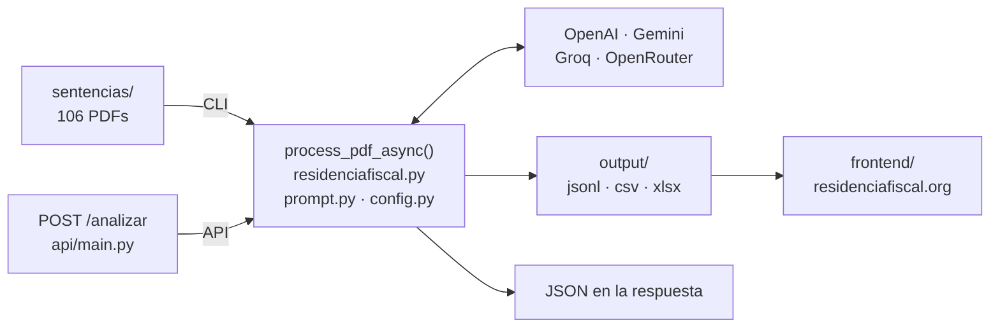

<div align="center">

# Residencia Fiscal

**Qué prueba gana un caso de residencia fiscal, según los tribunales.**

[](https://github.com/jmgb/residenciafiscal/actions/workflows/ci.yml)
[](https://github.com/jmgb/residenciafiscal/actions/workflows/frontend.yml)
[](LICENSE)
[](https://www.python.org/)
[](https://github.com/astral-sh/uv)

[residenciafiscal.org](https://residenciafiscal.org) · [Documentación](CLAUDE.md) · [Contribuir](CONTRIBUTING.md)

</div>

---

Pipeline en Python que analiza con LLMs **106 sentencias del Tribunal Supremo y
la Audiencia Nacional** (2015-2025) sobre residencia fiscal de personas físicas
(**Art. 9 LIRPF**), y convierte cada resolución en datos estructurados:

- **Criterios de residencia** aplicados: 183 días, ausencias esporádicas, centro
  de intereses económicos y vitales, presunción familiar, tie-breaker del CDI.
- **Pruebas aportadas** por AEAT y por el contribuyente, con su categoría, su
  peso, si el tribunal las aceptó y **por qué**, con cita literal y página.
- **Razonamiento judicial**: doctrina citada, sobre quién recaía la carga de la
  prueba y si la cumplió.
- **Resultado**: `GANA_AEAT` / `GANA_CONTRIBUYENTE` / `PARCIAL` / `RETROACCION` /
  `INADMISION`.

La pregunta de fondo no es qué dice la ley, sino qué acepta un juez como prueba.
Eso solo se ve agregando sentencias.

> [!WARNING]
> El análisis lo genera un modelo de lenguaje y **puede contener errores**. No es
> asesoramiento jurídico ni fiscal. Para citar una resolución, usa siempre el
> texto oficial del CENDOJ. Ver [`sentencias/AVISO_LEGAL.md`](sentencias/AVISO_LEGAL.md).

## Arquitectura

Dos frontends sobre el mismo núcleo. Ambos llaman a `process_pdf_async()`, así
que producen exactamente el mismo objeto.



| Archivo | Función |
|---------|---------|
| `residenciafiscal.py` | Pipeline principal (async, lotes de 10 PDFs) |
| `api/main.py` | API HTTP (FastAPI), 1 PDF por petición |
| `prompt.py` | System prompt con el contexto legal y el schema JSON |
| `config.py` | Modelos, rutas, enums y campos requeridos |
| `frontend/` | SPA React desplegada en Netlify |

### Los dos corpus

El repositorio versiona **fuentes originales** y, a partir de ellas, corpus
derivados y regenerables. Las fuentes nunca se editan a mano y su texto no se
reescribe en ningún punto del pipeline.

| Fuente | Derivado | Cómo se genera |
|--------|----------|----------------|
| `sentencias/` — 106 PDF del CENDOJ | `knowledge/jurisprudencia/` | LLM + verificación de citas contra el PDF |
| `normativa/` — 102 normas en XML del BOE | `knowledge/normativa/preceptos/` | Determinista, sin LLM (`make export-normativa`) |

Del corpus normativo se publica **un Markdown por artículo**, no por ley: los
preceptos que deciden o prueban la residencia fiscal, más el artículo de
residencia de cada uno de los 96 convenios de doble imposición firmados por
España. Ver [`docs/NORMATIVA.md`](docs/NORMATIVA.md).

## Puesta en marcha

Requiere [uv](https://docs.astral.sh/uv/) — gestiona Python y las dependencias.

```bash
curl -LsSf https://astral.sh/uv/install.sh | sh   # si no lo tienes

make setup                  # instala Python 3.13 + dependencias en .venv
cp .env.example .env        # y rellena OPENAI_API_KEY
make help                   # lista todos los comandos
```

No hace falta activar ningún entorno: `uv run` lo resuelve solo.

## Uso

```bash
make run-sample             # 1 PDF, prueba rápida (~$0.01)
make run                    # los 106 PDFs de ./sentencias (~$2.80, 2-3 h)
make run-resume             # continúa sobre el JSONL más reciente de ./output
make dev                    # API HTTP, Swagger en http://127.0.0.1:8010/docs
make fast-check             # lint + typecheck + tests
```

Variables de los targets de pipeline: `INPUT=`, `OUTPUT=`, `MODEL=`,
`EFFORT=low|medium|high`, `MAX_FILES=`.

Cada ejecución genera en `./output/`, con timestamp: `analisis_*.jsonl`,
`analisis_*.csv`, `sentencias_*.csv`, `pruebas_*.csv` y `analisis_*.xlsx`.

**Coste**: ~$0.006 por sentencia con el modelo por defecto. Las 23 sentencias
marcadas en `sentencias/sentencias_CLAVE.txt` usan automáticamente el modelo
premium (~$0.10 cada una) al margen del `--model` indicado.

## API

| Método | Ruta        | Descripción                                     |
|--------|-------------|-------------------------------------------------|
| GET    | `/health`   | Estado y API keys detectadas                    |
| GET    | `/config`   | Modelos, criterios y categorías vigentes        |
| POST   | `/analizar` | Sube un PDF y devuelve el análisis estructurado |
| GET    | `/docs`     | Swagger UI                                      |

```bash
curl -X POST -F "archivo=@sentencias/SAN_1226_2021.pdf" \
  http://127.0.0.1:8010/analizar | jq .
```

`POST /analizar` gasta dinero en cada llamada. Si defines
`RESIDENCIAFISCAL_API_TOKEN` en `.env`, la ruta exige la cabecera `X-API-Token`;
hazlo siempre que uses `make dev-public`, que escucha en `0.0.0.0`. La API es de
un PDF por petición y **no persiste nada** en `output/`: para lotes, usa
`make run`. Detalle de los guardarraíles en [`CLAUDE.md`](CLAUDE.md).

## Frontend

SPA React (Vite 8 + React 19 + TypeScript 7 + Tailwind 4) desplegada en Netlify:
un chatbot que consulta el corpus de sentencias en lenguaje natural.

```bash
cd frontend
npm install
npm run dev         # http://127.0.0.1:5174
npm run fast-check  # lint + typecheck + tests
npm run build       # genera el corpus y compila a dist/
```

> [!NOTE]
> El motor de conversación es hoy un **stub**. La interfaz está completa y las
> sentencias que cita son reales, pero las respuestas son simuladas. El backend
> RAG está pendiente de decidir; la UI muestra el aviso automáticamente mientras
> `chatEngineMode` valga `'stub'`.

## Documentación

| Documento | Contenido |
|-----------|-----------|
| [`CLAUDE.md`](CLAUDE.md) | Guía completa: arquitectura, schema de campos, costes, troubleshooting |
| [`CONTRIBUTING.md`](CONTRIBUTING.md) | Entorno, gates de CI y qué se espera de un PR |
| [`SECURITY.md`](SECURITY.md) | Cómo reportar una vulnerabilidad y qué está en el alcance |
| [`docs/CITATION_VERIFICATION.md`](docs/CITATION_VERIFICATION.md) | Pipeline, datos y rollout 1 → 5 → 106 para verificar citas contra los PDF |
| [`docs/OKF_PIPELINE.md`](docs/OKF_PIPELINE.md) | Ciclo híbrido JSONL/PDF → Markdown OKF y rollout validado de 1 → 5 |
| [`docs/NORMATIVA.md`](docs/NORMATIVA.md) | Corpus normativo: XML del BOE → un Markdown por precepto, sin LLM |
| [`docs/REASONING_EFFORT.md`](docs/REASONING_EFFORT.md) | El compromiso precisión / coste de los modelos GPT-5 |
| [`docs/brand/`](docs/brand/) | Brandbook y manifiesto |
| [`docs/operations/`](docs/operations/) | Despliegue en Netlify y configuración de Cloudflare |
| [`docs/tasks.md`](docs/tasks.md) | Backlog del proyecto |

## Licencia

Código y documentación bajo licencia [MIT](LICENSE).

Los documentos jurídicos que el repositorio incluye **no** están cubiertos por
esa licencia. Cada corpus se rige por las condiciones de reutilización de su
fuente:

- Las resoluciones judiciales de `sentencias/` son documentos públicos del
  CENDOJ, publicados ya pseudonimizados —
  [`sentencias/AVISO_LEGAL.md`](sentencias/AVISO_LEGAL.md).
- Los textos legales de `normativa/` proceden del BOE, cuya edición oficial es
  la única versión con valor jurídico —
  [`normativa/AVISO_LEGAL.md`](normativa/AVISO_LEGAL.md).

## Fuentes

- [Art. 9 LIRPF](https://www.boe.es/buscar/act.php?id=BOE-A-2006-20764) — residencia habitual en territorio español
- [Modelo de Convenio OCDE, Art. 4](https://www.oecd.org/tax/treaties/) — reglas de desempate de los CDI
- [CENDOJ](https://www.poderjudicial.es/search/) — buscador de jurisprudencia del CGPJ
- [Datos abiertos del BOE](https://www.boe.es/datosabiertos/) — origen del corpus normativo de `normativa/`
