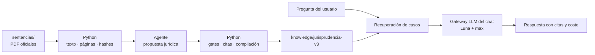

<div align="center">

# Residencia Fiscal

**Qué prueba gana un caso de residencia fiscal, según los tribunales.**

[](https://github.com/jmgb/residenciafiscal/actions/workflows/ci.yml)
[](https://github.com/jmgb/residenciafiscal/actions/workflows/frontend.yml)
[](LICENSE)
[](https://www.python.org/)
[](https://github.com/astral-sh/uv)

[residenciafiscal.org](https://residenciafiscal.org) · [Documentación](docs/README.md) · [Contribuir](CONTRIBUTING.md)

</div>

---

Proyecto con **106 sentencias fuente del Tribunal Supremo y la Audiencia
Nacional** (2015-2025) sobre residencia fiscal de personas físicas
(**Art. 9 LIRPF**). El corpus estructurado v3 está validado por ahora sobre una
muestra de cinco para consulta jurídica:

- **Criterios de residencia** aplicados: 183 días, ausencias esporádicas, centro
  de intereses económicos y vitales, presunción familiar, tie-breaker del CDI.
- **Pruebas aportadas** por AEAT y por el contribuyente, con su categoría, su
  peso, si el tribunal las aceptó y **por qué**, con cita literal y página.
- **Razonamiento judicial**: doctrina citada, sobre quién recaía la carga de la
  prueba y si la cumplió.
- **Resultado**: `GANA_AEAT` / `GANA_CONTRIBUYENTE` / `PARCIAL` / `RETROACCION` /
  `INADMISION`.

La pregunta de fondo no es qué dice la ley, sino qué acepta un juez como prueba.
Eso solo se ve agregando sentencias.

El corpus de hoy es español. El pipeline no lo es: cualquier jurisdicción puede
entrar si alguien aporta su jurisprudencia — ver
[Un país, un corpus](#un-país-un-corpus).

> [!WARNING]
> La estructura jurídica la propone un agente y **puede contener errores**. No
> es asesoramiento jurídico ni fiscal. Python conserva el texto literal, hashes
> y validaciones; para citar una resolución, usa siempre el texto oficial del
> CENDOJ. Ver [`sentencias/AVISO_LEGAL.md`](sentencias/AVISO_LEGAL.md).

## Arquitectura

El corpus se prepara offline sin llamadas del repositorio a APIs de modelos. El
gateway se reserva para responder preguntas cuando se implemente el chat real.



| Archivo | Función |
|---------|---------|
| `src/verbatim_*.py` | Extracción literal por páginas y hashes |
| `src/jurisprudence_*.py` | Compilación, validación y recuperación del corpus v3 |
| `src/chat_model_policy.py` | Política de inferencia del futuro chat |
| `src/gateway_setup.py` | Clientes, uso y costes de las respuestas del chat |
| `src/api/main.py` | API de estado y contratos; no analiza sentencias |
| `frontend/` | SPA React desplegada en Netlify |

La vista completa de componentes, flujos e invariantes está en
[`docs/ARCHITECTURE.md`](docs/ARCHITECTURE.md). La guía sobre dónde debe vivir
cada tipo de archivo está en
[`docs/REPOSITORY_STRUCTURE.md`](docs/REPOSITORY_STRUCTURE.md).

### Los dos corpus

El repositorio versiona **fuentes originales** y, a partir de ellas, corpus
derivados y regenerables. Las fuentes nunca se editan a mano y su texto no se
reescribe en ningún punto del pipeline.

| Fuente | Derivado | Cómo se genera |
|--------|----------|----------------|
| `sentencias/` — 106 PDF del CENDOJ | `knowledge/jurisprudencia-v3/` | Python + agente + gates literales |
| `normativa/es/` — 104 normas en XML del BOE | `knowledge/normativa/es/preceptos/` | Determinista, sin LLM (`make export-normativa`) |

Del corpus normativo se publica **un Markdown por artículo**, no por ley: los
preceptos que deciden o prueban la residencia fiscal, más el artículo de
residencia de cada uno de los 96 convenios de doble imposición firmados por
España. Un tercer artefacto, `knowledge/normativa/es/enlaces/`, resuelve qué
preceptos cita cada sentencia y con qué redacción del ejercicio enjuiciado.
Ver [`docs/normativa/NORMATIVA.md`](docs/normativa/NORMATIVA.md).

## Un país, un corpus

La residencia fiscal se decide en los tribunales de cada país, y la pregunta es
la misma en todos: **qué prueba acepta un juez**. Lo que cambia es el articulado
y quién lo interpreta.

España está publicada porque su jurisprudencia se delimitó con criterio
jurídico-tributario, no porque el proyecto sea español: qué resoluciones importan,
qué criterios del art. 9 LIRPF se aplican y en qué doce categorías se clasifica la
prueba son decisiones de derecho tributario, no de un modelo. El pipeline es
agnóstico de la jurisdicción; el criterio, no. Por eso **el proyecto se nutre de
la contribución de expertos en fiscalidad y tributación internacional**: abogados
y asesores fiscales, académicos, documentalistas jurídicos, traductores
jurídicos, economistas y peritos, además de desarrolladores.

> [!TIP]
> **[Propón tu país](https://github.com/jmgb/residenciafiscal/issues/new?template=aportar_pais.yml)**
> o escribe a **info@residenciafiscal.org** — cualquier jurisdicción, no solo las
> que ya tienen ruta en la web. No hace falta saber programar: lo que falta es
> criterio jurídico, no código. Página pública:
> [residenciafiscal.org/colaborar](https://residenciafiscal.org/colaborar).

Un país entra cuando existen tres cosas. Rara vez las aporta una sola persona:

| Lo que hace falta | Por qué |
|---|---|
| **Una fuente pública oficial** de resoluciones, con sus condiciones de reutilización | El corpus se publica desde la fuente original y sin licencia clara no se publica. Los PDF deben llevar capa de texto: no hay OCR |
| **El precepto nacional que decide la residencia** — el equivalente al [art. 9 LIRPF](https://www.boe.es/buscar/act.php?id=BOE-A-2006-20764) — y el artículo de desempate de sus convenios | El análisis de una sentencia no se sostiene sin la norma que aplica |
| **Un especialista que valide el resultado** | La propuesta jurídica del agente puede equivocarse. Ningún país se publica sin que un profesional del derecho tributario de esa jurisdicción lo valide |

Lo que **no** hace falta aportar: el pipeline, la verificación de citas contra el
documento fuente, el schema de extracción ni el frontend. Eso ya existe y es
común a todos los países.

Dos invariantes rigen cualquier corpus nuevo, igual que el español:

- **El texto de una resolución no se reescribe.** Ni se corrige, ni se completa,
  ni se parafrasea. Una cita solo se publica desde una subcadena exacta del texto
  extraído del documento oficial. Las correcciones viven en metadatos aparte.
- **Cada corpus se aísla del resto.** Una consulta sobre un país no puede
  devolver una cita de otro, y hay tests que lo comprueban.

El criterio para arrancar el siguiente país no es el orden de llegada: es el
primero que reúna una **fuente reutilizable y un revisor comprometido**. El
proyecto lo mantiene una persona en su tiempo libre, así que no hay plazos
prometidos.

El detalle operativo y la tabla de perfiles están en
[CONTRIBUTING.md](CONTRIBUTING.md#aportar-la-jurisprudencia-de-otro-país); el
estado de las páginas por país, en
[`docs/product/COUNTRY_PAGES.md`](docs/product/COUNTRY_PAGES.md).

## Puesta en marcha

Requiere [uv](https://docs.astral.sh/uv/) — gestiona Python y las dependencias.

```bash
curl -LsSf https://astral.sh/uv/install.sh | sh   # si no lo tienes

make setup                  # instala Python 3.13 + dependencias en .venv
make help                   # lista todos los comandos
```

No hace falta activar ningún entorno: `uv run` lo resuelve solo.

## Uso

```bash
make export-verbatim        # extrae el PDF piloto sin LLM
make export-case-v3         # compila el caso propuesto por el agente
make export-case-v3-sample  # regenera y valida la muestra de cinco
make dev                    # API + frontend en desarrollo
make dev-api                # solo API HTTP, Swagger en http://127.0.0.1:8010/docs
make fast-check             # lint + typecheck + tests
```

La propuesta jurídica de cada sentencia se prepara en una sesión de agente. No
existe un target que envíe los PDF a OpenAI. Los comandos Python extraen,
validan y compilan de forma determinista.

## API

| Método | Ruta        | Descripción                                     |
|--------|-------------|-------------------------------------------------|
| GET    | `/health`   | Estado y frontera entre corpus y chat            |
| GET    | `/config`   | Política del chat, criterios y categorías        |
| GET    | `/docs`     | Swagger UI                                      |

La API no expone `/analizar`. El futuro endpoint conversacional utilizará el
gateway únicamente después de recuperar evidencia del corpus.

## Frontend

SPA React (Vite 8 + React 19 + TypeScript 7 + Tailwind 4) desplegada en Netlify:
un chatbot que consulta el corpus de sentencias en lenguaje natural.

```bash
cd frontend
npm install
npm run dev         # http://127.0.0.1:5174
npm run fast-check  # lint + typecheck + tests
npm run build       # genera el corpus y compila a dist/
```

> [!NOTE]
> El motor de conversación es hoy un **stub**. La interfaz está completa y las
> sentencias que cita son reales, pero las respuestas son simuladas. El backend
> RAG está pendiente de decidir; la UI muestra el aviso automáticamente mientras
> `chatEngineMode` valga `'stub'`.

## Documentación

| Documento | Contenido |
|-----------|-----------|
| [`docs/README.md`](docs/README.md) | Índice temático de toda la documentación |
| [`docs/ARCHITECTURE.md`](docs/ARCHITECTURE.md) | Componentes, flujos, límites e invariantes |
| [`docs/REPOSITORY_STRUCTURE.md`](docs/REPOSITORY_STRUCTURE.md) | Convenciones de carpetas y rutas |
| [`CLAUDE.md`](CLAUDE.md) | Guía operativa, comandos, costes y troubleshooting |
| [`CONTRIBUTING.md`](CONTRIBUTING.md) | Entorno, gates de CI y qué se espera de un PR |
| [`SECURITY.md`](SECURITY.md) | Cómo reportar una vulnerabilidad y qué está en el alcance |

## Licencia

Código y documentación bajo licencia [MIT](LICENSE).

Los documentos jurídicos que el repositorio incluye **no** están cubiertos por
esa licencia. Cada corpus se rige por las condiciones de reutilización de su
fuente:

- Las resoluciones judiciales de `sentencias/` son documentos públicos del
  CENDOJ, publicados ya pseudonimizados —
  [`sentencias/AVISO_LEGAL.md`](sentencias/AVISO_LEGAL.md).
- Los textos legales de `normativa/` proceden del BOE, cuya edición oficial es
  la única versión con valor jurídico —
  [`normativa/es/AVISO_LEGAL.md`](normativa/es/AVISO_LEGAL.md).

## Fuentes

- [Art. 9 LIRPF](https://www.boe.es/buscar/act.php?id=BOE-A-2006-20764) — residencia habitual en territorio español
- [Modelo de Convenio OCDE, Art. 4](https://www.oecd.org/tax/treaties/) — reglas de desempate de los CDI
- [CENDOJ](https://www.poderjudicial.es/search/) — buscador de jurisprudencia del CGPJ
- [Datos abiertos del BOE](https://www.boe.es/datosabiertos/) — origen del corpus normativo de `normativa/`
