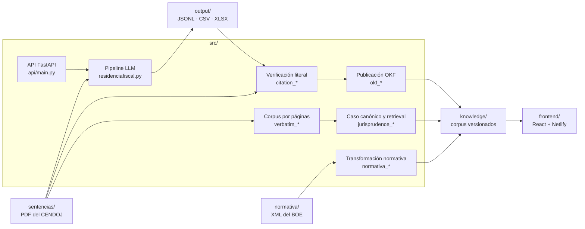

# Arquitectura

Residencia Fiscal transforma documentos jurídicos oficiales en datos
estructurados y corpus consultables. El sistema separa las fuentes originales,
la lógica Python, los artefactos derivados y las interfaces de usuario.

## Vista general

## Componentes

| Área | Ubicación | Responsabilidad |
|---|---|---|
| Pipeline principal | `src/residenciafiscal.py` | Extraer texto de PDF, llamar al proveedor LLM y escribir exports |
| Configuración de dominio | `src/config.py`, `src/prompt.py` | Modelos, catálogos, campos y prompt de extracción |
| Proveedores LLM | `src/ai_service_adapter.py`, `src/model_pricing.py` | Adaptar proveedores y calcular costes |
| API HTTP | `src/api/` | Exponer el pipeline para un PDF sin persistir resultados |
| Citas | `src/citation_*.py`, `src/legal_text_matching.py` | Localizar y verificar extractos literales |
| Jurisprudencia v3 | `src/jurisprudence_*.py` | Compilar casos, validar referencias, recuperar y evaluar |
| OKF | `src/okf_*.py` | Normalizar, renderizar y validar perfiles publicables |
| Verbatim | `src/verbatim_*.py` | Representar el texto íntegro por páginas con hashes |
| Normativa | `src/normativa_*.py` y CLIs relacionados | Convertir XML oficial del BOE y enlazar preceptos |
| Contratos serializados | `schemas/` | JSON Schema versionados |
| Pruebas | `tests/` | Gates deterministas; las llamadas LLM reales están excluidas por defecto |

Los módulos Python conservan imports planos dentro de `src/`. Es una decisión de
compatibilidad: permite ordenar la raíz sin mezclar el cambio físico con una
migración pública de nombres. Una futura división en paquetes debe hacerse por
dominio y con una migración de imports independiente.

## Flujos principales

### Análisis LLM

1. `src/residenciafiscal.py` lee los PDF de `sentencias/`.
2. `pypdf` extrae la capa de texto; no hay OCR.
3. El adaptador selecciona el proveedor y aplica el prompt canónico.
4. El pipeline valida la respuesta y escribe los artefactos locales en
   `output/`.
5. `src/api/main.py` reutiliza el mismo proceso para una petición individual.

### Jurisprudencia verificable

1. La verificación contrasta cada cita con el texto extraído del PDF.
2. El corpus verbatim conserva páginas, hashes y procedencia.
3. Los módulos `jurisprudence_*` compilan el caso canónico y sus unidades de
   recuperación.
4. Los módulos `okf_*` producen perfiles Markdown e informes laterales.
5. Los derivados versionados se publican en `knowledge/`.

### Normativa

1. Los XML oficiales se guardan en `normativa/<jurisdicción>/`.
2. La selección de preceptos es explícita y jurídicamente delimitada.
3. La exportación copia el texto de la fuente, sin LLM ni reescritura.
4. Los preceptos y enlaces derivados se guardan en
   `knowledge/normativa/<jurisdicción>/`.

## Invariantes

- Una cita judicial o un precepto legal publicado debe proceder de una
  subcadena exacta de la fuente oficial.
- La normalización ayuda a localizar texto, nunca a reconstruirlo.
- Los corpus de jurisdicciones distintas permanecen aislados.
- Los artefactos de `output/` son locales y regenerables; no son fuente de
  verdad.
- Los schemas, modelos, validadores, tests y documentación contractual deben
  evolucionar juntos.
- Los tests ordinarios no realizan llamadas LLM ni requieren secrets.

## Límites actuales

- Los PDF escaneados sin capa de texto no se procesan porque no hay OCR.
- La API local no tiene rate limiting.
- El frontend conversacional sigue usando un motor simulado mientras no se
  conecte un backend RAG revisado.
- El rollout 1 → 5 → 106 exige gates y revisión humana; no se amplía el corpus
  automáticamente.

Los contratos detallados están indexados en la
[documentación de jurisprudencia](README.md#jurisprudencia) y en la
[documentación normativa](normativa/NORMATIVA.md).
