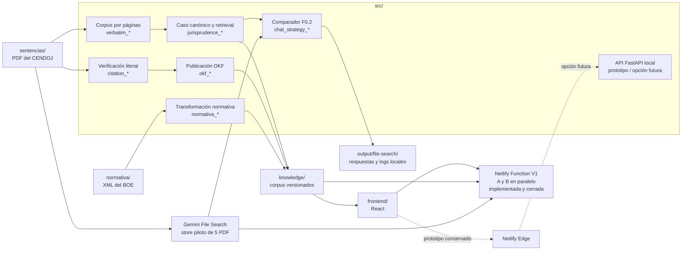

# Arquitectura

Residencia Fiscal transforma documentos jurídicos oficiales en datos
estructurados y corpus consultables. El sistema separa las fuentes originales,
la lógica Python, los artefactos derivados y las interfaces de usuario.

El corpus v3 se prepara offline mediante Python + agente y actualmente está
validado sobre cinco sentencias. La inferencia LLM pertenece exclusivamente al
chat online; no existe un analizador automático de sentencias.

## Vista general

## Componentes

| Área | Ubicación | Responsabilidad |
|---|---|---|
| Configuración de dominio | `src/config.py` | Catálogos jurídicos y routing de proveedores |
| Política del chat | `src/chat_model_policy.py` | Luna + `high`, separado del corpus |
| Proveedores LLM | `src/gateway_setup.py`, `src/gateway_chat_writer.py` | Responder preguntas del chat y registrar uso/coste |
| API HTTP Python | `src/api/` | Prototipo local y posible runtime futuro para llamadas de más de 60 s |
| Citas | `src/citation_*.py`, `src/legal_text_matching.py` | Localizar y verificar extractos literales |
| Jurisprudencia v3 | `src/jurisprudence_*.py` | Compilar casos, validar referencias, recuperar y evaluar |
| OKF | `src/okf_*.py` | Normalizar, renderizar y validar perfiles publicables |
| Verbatim | `src/verbatim_*.py` | Representar el texto íntegro por páginas con hashes |
| Normativa | `src/normativa_*.py` y CLIs relacionados | Convertir XML oficial del BOE y enlazar preceptos |
| Chat experimental | `src/chat_*.py`, `src/current_structured_strategy.py`, `src/gemini_file_search_*.py` | Comparar A estructurada y B File Search con fuentes, coste y errores separados |
| Runtime web V1 | `frontend/netlify/functions/chat/`, más `frontend/src/lib/chat-*` | Ejecutar A/B en paralelo dentro de Netlify y presentar el protocolo comparativo |
| Persistencia web V1 | `supabase/migrations/`, `supabase-chat-store.ts` | Reserva atómica y mensajes A/B con citas, uso y coste en schema privado |
| Transporte web conservado | `frontend/netlify/prototypes/chat-fastapi-edge.ts` | Proxy del prototipo FastAPI; opción futura, no target V1 |
| Evaluación ciega | `src/chat_blind_review.py` | Sanear, equilibrar y materializar X/Y con hashes y clave separada |
| Contratos serializados | `schemas/` | JSON Schema versionados |
| Pruebas | `tests/` | Gates deterministas; las llamadas LLM reales están excluidas por defecto |

Los módulos Python conservan imports planos dentro de `src/`. Es una decisión de
compatibilidad: permite ordenar la raíz sin mezclar el cambio físico con una
migración pública de nombres. Una futura división en paquetes debe hacerse por
dominio y con una migración de imports independiente.

## Flujos principales

### Jurisprudencia verificable

1. Python extrae el verbatim y conserva páginas, hashes y procedencia.
2. El agente propone cuestiones, hechos, valoraciones y anclajes literales.
3. Python contrasta cada cita con el PDF y los módulos `jurisprudence_*`
   compilan el caso canónico y sus unidades de
   recuperación.
4. Los módulos `okf_*` producen perfiles Markdown e informes laterales.
5. Los derivados versionados se publican en `knowledge/`.

### Chat jurisprudencial comparativo

1. El frontend permanece en `stub` por defecto; un build `live` envía la
   pregunta a `/api/chat`.
2. La V1 usa una Netlify Function TypeScript autosuficiente, con rate limit,
   presupuesto y un deadline global de 50–55 s.
3. La Function inicia A y B en paralelo. A recupera unidades v3, limita el
   contexto y redacta mediante IDs de evidencia que se resuelven localmente.
4. B consulta de forma independiente un File Search Store con los cinco PDF
   originales y devuelve anotaciones del proveedor.
5. Ambas rutas verifican sus fuentes y retiran cualquier respuesta sustantiva
   que quede sin respaldo.
6. La Function serializa dos bloques con protocolo SSE 2 en orden visual A → B,
   pero devuelve el cuerpo completo de forma bufferizada para conservar el
   límite sincrónico estándar; el frontend conserva
   respuesta, estado, fuentes, latencia y coste por
   estrategia, sin usar la salida de una como entrada de la otra.

Arquitectura, estado, aprendizajes y siguiente gate:
[`jurisprudence/CHAT_SYSTEM_ARCHITECTURE.md`](jurisprudence/CHAT_SYSTEM_ARCHITECTURE.md).

### Normativa

1. Los XML oficiales se guardan en `normativa/<jurisdicción>/`.
2. La selección de preceptos es explícita y jurídicamente delimitada.
3. La exportación copia el texto de la fuente, sin LLM ni reescritura.
4. Los preceptos y enlaces derivados se guardan en
   `knowledge/normativa/<jurisdicción>/`.

## Invariantes

- Una cita judicial o un precepto legal publicado debe proceder de una
  subcadena exacta de la fuente oficial.
- La normalización ayuda a localizar texto, nunca a reconstruirlo.
- Los corpus de jurisdicciones distintas permanecen aislados.
- Los artefactos de `output/` son locales y regenerables; no son fuente de
  verdad.
- Los schemas, modelos, validadores, tests y documentación contractual deben
  evolucionar juntos.
- Los tests ordinarios no realizan llamadas LLM ni requieren secrets.
- Ningún módulo de preparación `jurisprudence_*` importa el gateway del chat.

## Límites actuales

- Los PDF escaneados sin capa de texto no se procesan porque no hay OCR.
- La Function Netlify-only, el prototipo FastAPI, el protocolo y la UI A/B están
  implementados. Producción sigue cerrada a falta del Deploy Preview real,
  configuración de Database y requisitos legales.
- El frontend de producción sigue usando el motor simulado. La activación exige
  demostrar en Deploy Preview que el recorrido completo cabe bajo 60 s,
  provisionar el presupuesto y superar los gates legales/humanos.
- FastAPI no se borra: se reevaluará si hacen falta llamadas de más de 60 s,
  reintentos largos o mayor control operativo.
- El rollout 1 → 5 → 106 exige gates y revisión humana; no se amplía el corpus
  automáticamente.

Los contratos detallados están indexados en la
[documentación de jurisprudencia](README.md#jurisprudencia) y en la
[documentación normativa](normativa/NORMATIVA.md).
