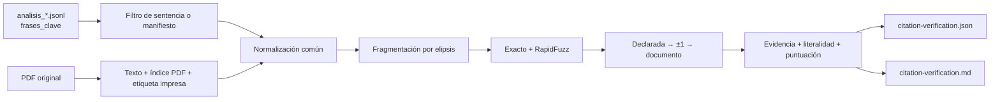

# Pipeline de verificación de citas

Este documento describe cómo se contrastan las `frases_clave` generadas por el
LLM con el texto de los PDF originales. El proceso es determinista, no llama a
ningún modelo y no modifica las sentencias ni el JSONL.

## Estado y alcance

La implantación sigue un rollout progresivo:

| Etapa | Corpus | Estado |
|---|---:|---|
| Piloto | 1 sentencia (`SAN_1071_2025.pdf`) | Implementado y ejecutado |
| Validación ampliada | 5 sentencias representativas | Manifiesto preparado; no ejecutado |
| Corpus | 106 sentencias | Pendiente de aprobar la muestra de 5 |

`make verify-citations` ejecuta únicamente el piloto de una sentencia. El
manifiesto de cinco existe para que la siguiente muestra sea estable y
reproducible, pero no se ha ejecutado todavía.

## Datos disponibles

El repositorio mantiene o genera estas representaciones:

| Representación | Ubicación | Contenido | Se versiona |
|---|---|---|:---:|
| Fuente | `sentencias/*.pdf` | Resolución original del CENDOJ | Sí, bajo sus condiciones propias |
| Análisis | `output/analisis_*.jsonl` | Datos jurídicos estructurados, incluida `frases_clave` | No |
| Catálogo web | `frontend/public/data/corpus.json` | Metadatos ligeros para la SPA | Sí |
| Texto por páginas | Memoria durante la ejecución | Texto extraído mediante `pypdf` | No |
| Informe | `output/citation-verification/` | JSON detallado y resumen Markdown | No |

No existe un `.txt` completo por sentencia. El verificador extrae las páginas
directamente del PDF una sola vez por documento y reutiliza esa extracción para
todas sus citas.

## Decisión de modelo: evidencia y literalidad son ejes distintos

Encontrar un pasaje parecido no demuestra que el LLM lo haya citado
literalmente. Por eso el resultado separa:

- `evidence_found`: booleano que indica si se localizaron todos los fragmentos;
- `evidence_status`: dónde se ha localizado evidencia que supera el umbral;
- `literal_fidelity`: si el texto coincide exactamente, usa elipsis explícitas
  válidas o solo constituye un candidato aproximado.

Una coincidencia fuzzy puede ser útil para localizar el fundamento jurídico y,
al mismo tiempo, quedar como `fuzzy_candidate`: no se presenta como cita
literal. Esta separación evita que bajar el umbral infle la tasa de citas
literales.

### Estados de localización

| `evidence_status` | Significado |
|---|---|
| `found_declared_page` | Todos los fragmentos superan el umbral en la página declarada |
| `found_adjacent_page` | Se necesitan la página anterior o posterior |
| `found_other_page` | La evidencia aparece en otra parte del documento |
| `partial_fragments` | Solo parte de los fragmentos supera el umbral |
| `not_found` | Ningún fragmento supera el umbral |
| `extraction_defect` | El PDF no produjo texto utilizable |
| `processing_error` | Falta el PDF o su lectura lanzó un error |

`processing_error` pertenece al informe por lotes; no es un valor del verificador
puro.

### Grados de fidelidad

| `literal_fidelity` | Significado |
|---|---|
| `exact` | Una cita continua coincide tras normalización |
| `exact_with_ellipsis` | Todos los fragmentos separados por elipsis explícitas coinciden exactamente |
| `fuzzy_candidate` | Toda la evidencia se localiza, pero al menos un fragmento solo coincide aproximadamente |
| `partial` | Solo se ha localizado parte de la cita |
| `unverified` | No hay texto suficiente para evaluar literalidad |

La normalización elimina diferencias tipográficas —mayúsculas, acentos,
ligaduras, espacios o guiones de fin de línea—, no diferencias sustantivas.

## Qué son las puntuaciones y para qué se usan

Cada fragmento recibe una similitud de **0 a 100**:

- `100` significa coincidencia exacta después de la normalización;
- un valor menor procede de `RapidFuzz.fuzz.partial_ratio` y mide cuánto se
  parece el fragmento al mejor pasaje de una página;
- la puntuación de la cita completa es la del fragmento más débil, porque un
  promedio podría ocultar una omisión importante.

El umbral —85 provisionalmente— solo decide si una coincidencia aproximada sirve
para **localizar evidencia**. No decide si la cita es literal: eso lo determina
`literal_fidelity`.

Las puntuaciones no serían necesarias en un sistema exclusivamente exacto, pero
sí son útiles aquí para:

- encontrar pasajes afectados por OCR, ligaduras o pequeñas omisiones;
- ordenar y priorizar candidatos para revisión humana;
- medir falsos positivos y falsos negativos antes de fijar el gate.

Se conservan como señal diagnóstica, no como medida de validez jurídica. Antes
de procesar las 106 sentencias conviene calcular cada similitud una sola vez y
reutilizarla para los distintos umbrales; con una o cinco sentencias el coste
actual es irrelevante.

## Numeración de páginas

El pipeline conserva dos referencias y no infiere equivalencias:

| Campo | Significado |
|---|---|
| `pdf_page_index` | Posición física de la página en el PDF, empezando en 1 |
| `printed_page_label` | Número o romano aislado impreso al final de la página; puede ser `null` |

El campo `pagina` del JSONL actual se interpreta como
`declared_pdf_page_index`. La etiqueta impresa se detecta de forma conservadora
y se registra como evidencia auxiliar; si no existe, no se inventa un
desplazamiento.

En el PDF del piloto ambas numeraciones coinciden (`3` con `3`, `4` con `4`).
Por tanto, la cita declarada en la página 3 y encontrada en la 4 es un
desplazamiento real del dato actual, no una portada sin numerar.

## Flujo



El algoritmo:

1. Lee únicamente entradas válidas de `frases_clave`.
2. Extrae cada PDF una vez y conserva ambas referencias de página.
3. Normaliza Unicode, ligaduras, acentos, espacios y guiones de fin de línea.
4. Divide la cita por elipsis (`...`, `…`, `[…]` o `(...)`).
5. Descarta fragmentos demasiado cortos para evitar coincidencias accidentales.
6. Para cada fragmento, prueba primero una subcadena normalizada exacta y, si
   falla, conserva la mejor puntuación aproximada.
7. Busca de forma escalonada en la página declarada, las adyacentes y el
   documento completo.
8. Clasifica por separado localización y fidelidad.
9. Registra el resultado; nunca reescribe la cita del JSONL.

## Contrato de salida

Ejemplo abreviado de `citation-verification.json`:

```json
{
  "source_file": "SAN_1071_2025.pdf",
  "citation_index": 1,
  "topic": "prueba",
  "declared_page_raw": "3",
  "quote": "suministros de agua y electricidad...",
  "evidence_found": true,
  "evidence_status": "found_adjacent_page",
  "literal_fidelity": "exact",
  "score": 100.0,
  "declared_pdf_page_index": 3,
  "declared_page_valid": true,
  "matched_pdf_page_indexes": [4],
  "matched_printed_page_labels": ["4"],
  "matched_fragment_count": 1,
  "total_fragment_count": 1,
  "fragment_matches": [
    {
      "fragment": "suministros de agua y electricidad",
      "score": 100.0,
      "pdf_page_index": 4,
      "printed_page_label": "4",
      "exact": true,
      "matched": true
    }
  ]
}
```

El informe incluye además el hash SHA-256 del JSONL, el alcance exacto, los
agregados de ambos ejes y la sensibilidad a los umbrales 70, 75, 80, 85, 90 y
95.

## Resultado del piloto de una sentencia

Piloto regenerado sobre las cuatro `frases_clave` de
`SAN_1071_2025.pdf`:

| Umbral | Evidencia localizada | Citas literales |
|---:|---:|---:|
| 70–80 | 4/4 (100 %) | 3/4 (75 %) |
| 85–95 | 3/4 (75 %) | 3/4 (75 %) |

Con umbral 85:

- dos citas son exactas en la página declarada;
- una es exacta en la página adyacente;
- una queda como `partial_fragments` y fidelidad `partial`.

El fragmento límite obtiene 80,56. El PDF dice «restaurantes y **los de**
repostaje de gasolina», mientras que el JSONL omite «los de» sin marcar la
omisión. Al bajar el umbral a 80 se localiza la evidencia, pero su fidelidad
pasa a `fuzzy_candidate`, no a literal.

Se mantiene 85 como umbral conservador provisional. Cuatro citas no bastan para
fijar el gate global.

Los artefactos regenerables están en:

```text
output/citation-verification/citation-verification.json
output/citation-verification/citation-verification.md
```

## Muestra fija de cinco

`sentencias/verificacion_citas_muestra_5.json` fija el orden, la motivación y los
casos que debe cubrir la siguiente fase. Incluye:

1. `SAN_1071_2025.pdf`
2. `SAN_1136_2016.pdf`
3. `SAN_1210_2023.pdf`
4. `SAN_1226_2021.pdf`
5. `SAN_1386_2017.pdf`

El manifiesto tiene esquema estricto, rechaza duplicados o una cardinalidad
incoherente y sus cinco PDF se validan en tests. Está preparado, pero **no se ha
ejecutado**: primero se revisa y aprueba el piloto.

## Ejecución

```bash
# Única ejecución autorizada hoy: piloto fijado a una sentencia
make verify-citations

# Otra sentencia individual, sin ampliar el número de documentos
make verify-citations CITATION_SOURCE_FILE=SAN_1136_2016.pdf

# Umbral alternativo para inspección; no cambia el default
make verify-citations CITATION_THRESHOLD=80
```

El target elige el `output/analisis_*.jsonl` más reciente. Para fijar uno:

```bash
make verify-citations \
  CITATION_JSONL=output/analisis_02012026_155032.jsonl
```

El CLI admite el manifiesto para la fase siguiente:

```bash
# No ejecutar hasta aprobar expresamente el paso de 1 a 5
uv run python verify_citations.py \
  --jsonl output/analisis_02012026_155032.jsonl \
  --pdf-dir sentencias \
  --manifest sentencias/verificacion_citas_muestra_5.json \
  --threshold 85
```

## Componentes

| Archivo | Responsabilidad |
|---|---|
| `legal_text_matching.py` | Normalización, fragmentación y similitud |
| `citation_models.py` | Contratos de páginas, fragmentos y resultados |
| `pdf_page_extraction.py` | Texto, índice físico y etiqueta impresa |
| `citation_result_builder.py` | Construcción del resultado y clasificación literal |
| `citation_verification.py` | Búsqueda escalonada de una cita |
| `citation_spike.py` | Candidatos, selección, caché PDF y ejecución por lote |
| `citation_sample_manifest.py` | Validación estricta de muestras versionadas |
| `citation_report.py` | Agregados y contrato JSON |
| `citation_report_details.py` | Detalle Markdown por cita |
| `verify_citations.py` | CLI y escritura de artefactos |
| `sentencias/verificacion_citas_muestra_5.json` | Próxima muestra fija, todavía no ejecutada |

Los tests asociados están en `test/test_citation_*.py` y
`test/test_verify_citations_cli.py`.

## Gates para avanzar

### De una a cinco sentencias

- `make fast-check` verde.
- Informe JSON y Markdown del piloto generados.
- Las cuatro citas revisadas manualmente.
- Ningún resultado fuzzy presentado como cita literal.
- Distinción de índice PDF y etiqueta impresa persistida.
- Manifiesto de cinco revisado y aprobado.

### De cinco al corpus completo

Todavía no está autorizado. La muestra debe permitir:

- estimar falsos positivos y falsos negativos;
- revisar manualmente todos los `fuzzy_candidate`;
- observar páginas declaradas inválidas o desplazadas;
- comprobar documentos sin texto;
- fijar umbral y gate con datos, no extrapolando cuatro citas;
- optimizar la reutilización de puntuaciones entre umbrales si el volumen lo
  justifica.

## Límites y decisiones

- No hay llamadas LLM.
- Los PDF nunca se modifican.
- El texto completo extraído no se versiona.
- Los artefactos de `output/` son regenerables y quedan fuera de Git.
- Las decisiones humanas futuras deben vivir en sidecars; no se edita un
  resultado generado para hacerlo pasar.
- Localizar texto no demuestra que la interpretación jurídica sea correcta.
