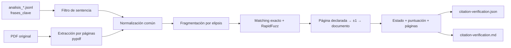

# Pipeline de verificación de citas

Este documento describe cómo se contrastan las `frases_clave` generadas por el
LLM con el texto de los PDF originales. El proceso es determinista, no llama a
ningún modelo y no modifica las sentencias.

## Estado y alcance

La implantación sigue un rollout deliberadamente progresivo:

| Etapa | Corpus | Estado |
|---|---:|---|
| Piloto | 1 sentencia (`SAN_1071_2025.pdf`) | Implementado |
| Validación ampliada | 5 sentencias representativas | Pendiente de aprobar el piloto |
| Corpus | 106 sentencias | Pendiente de aprobar la muestra de 5 |

`make verify-citations` ejecuta únicamente el piloto de una sentencia. No debe
ampliarse el alcance sin revisar primero el informe de la etapa anterior.

## Datos disponibles

El repositorio mantiene o genera estas representaciones:

| Representación | Ubicación | Contenido | Se versiona |
|---|---|---|:---:|
| Fuente | `sentencias/*.pdf` | Resolución original del CENDOJ | Sí, bajo sus condiciones propias |
| Análisis | `output/analisis_*.jsonl` | Datos jurídicos estructurados, incluida `frases_clave` | No |
| Catálogo web | `frontend/public/data/corpus.json` | Metadatos ligeros para la SPA | Sí |
| Texto por páginas | Memoria durante la ejecución | Texto extraído mediante `pypdf` | No |
| Informe del spike | `output/citation-verification/` | Resultado JSON detallado y resumen Markdown | No |

No existe todavía un `.txt` completo por sentencia. El verificador extrae las
páginas directamente del PDF, una sola vez por documento, y reutiliza esa
extracción para todas sus citas.

## Flujo



El algoritmo:

1. Lee únicamente las entradas válidas de `frases_clave`.
2. Normaliza Unicode, ligaduras, acentos, espacios y guiones de final de línea.
3. Divide la cita por elipsis (`...`, `…`, `[…]` o `(...)`).
4. Descarta fragmentos demasiado cortos para evitar coincidencias accidentales.
5. Para cada fragmento:
   - comprueba primero una subcadena normalizada exacta;
   - si no existe, calcula `RapidFuzz.fuzz.partial_ratio`;
   - conserva la mejor puntuación y su página.
6. Busca de forma escalonada:
   - página declarada;
   - página declarada y adyacentes;
   - documento completo.
7. La puntuación global de una cita es la del fragmento más débil. Un promedio
   podría ocultar un fragmento no verificable.
8. Registra el resultado; nunca reescribe automáticamente la cita del JSONL.

RapidFuzz es adecuado aquí porque `partial_ratio` busca la alineación de una
cadena corta dentro de un texto más largo. La dependencia está fijada en
`pyproject.toml` y `uv.lock`.

## Modelo de datos

### Entrada

El verificador consume este subconjunto de cada registro del JSONL:

```json
{
  "archivo": "SAN_1071_2025.pdf",
  "frases_clave": [
    {
      "tema": "prueba",
      "pagina": "3",
      "texto": "suministros de agua y electricidad..."
    }
  ]
}
```

El resto del análisis jurídico no participa en el matching.

### Resultado por cita

`citation-verification.json` conserva:

```json
{
  "source_file": "SAN_1071_2025.pdf",
  "citation_index": 1,
  "topic": "prueba",
  "declared_page_raw": "3",
  "quote": "suministros de agua y electricidad...",
  "status": "verified_adjacent_page",
  "score": 100.0,
  "declared_page": 3,
  "declared_page_valid": true,
  "matched_pages": [4],
  "matched_fragment_count": 1,
  "total_fragment_count": 1,
  "fragment_matches": [
    {
      "fragment": "suministros de agua y electricidad",
      "score": 100.0,
      "page_number": 4,
      "exact": true,
      "matched": true
    }
  ]
}
```

El informe incluye además:

- hash SHA-256 del JSONL;
- sentencia seleccionada;
- umbral usado;
- sensibilidad a los umbrales 70, 75, 80, 85, 90 y 95;
- agregados por estado y causa observable;
- detalle legible de cada cita.

### Estados

| Estado | Significado |
|---|---|
| `verified_declared_page` | Todos los fragmentos superan el umbral en la página declarada |
| `verified_adjacent_page` | Se necesitan las páginas adyacentes |
| `verified_other_page` | La cita aparece en otra parte del documento |
| `partial_fragments` | Solo una parte de los fragmentos supera el umbral |
| `not_found` | Ningún fragmento supera el umbral |
| `extraction_defect` | El PDF no produjo texto utilizable |
| `processing_error` | Falta el PDF o su lectura lanzó un error |

Un resultado fuzzy no convierte una paráfrasis en cita literal. Por eso el JSON
conserva `exact` por fragmento y el informe permite revisión humana.

## Resultado del piloto

Piloto ejecutado sobre las cuatro `frases_clave` de `SAN_1071_2025.pdf`:

| Umbral | Verificadas | Tasa |
|---:|---:|---:|
| 70–80 | 4/4 | 100 % |
| 85–95 | 3/4 | 75 % |

Con umbral 85:

- dos citas se verifican exactamente en la página declarada;
- una se verifica exactamente en la página adyacente;
- una queda como `partial_fragments`.

El fragmento límite obtiene 80,56. El PDF dice «restaurantes y **los de**
repostaje de gasolina», mientras que el JSONL omite «los de» sin señalar esa
omisión. Es jurídicamente fiel, pero no literalmente idéntico. Por ello:

- se conserva **85** como umbral conservador del piloto;
- la cuarta cita no se etiqueta todavía como verificada;
- cuatro citas no bastan para fijar el gate global;
- la muestra de cinco debe contener casos exactos, elipsis, paráfrasis y páginas
  erróneas antes de decidir el umbral definitivo.

El informe vigente se regenera en:

```text
output/citation-verification/citation-verification.json
output/citation-verification/citation-verification.md
```

## Ejecución

```bash
# Piloto fijado a SAN_1071_2025.pdf y umbral 85
make verify-citations

# Otra sentencia individual, sin ampliar el número de documentos
make verify-citations CITATION_SOURCE_FILE=SAN_1136_2016.pdf

# Umbral alternativo para inspección; no cambia el default
make verify-citations CITATION_THRESHOLD=80
```

El target elige el `output/analisis_*.jsonl` más reciente. Para fijar uno:

```bash
make verify-citations \
  CITATION_JSONL=output/analisis_02012026_155032.jsonl
```

También se puede usar el CLI directamente:

```bash
uv run python verify_citations.py \
  --jsonl output/analisis_02012026_155032.jsonl \
  --pdf-dir sentencias \
  --source-file SAN_1071_2025.pdf \
  --threshold 85
```

## Componentes

| Archivo | Responsabilidad |
|---|---|
| `legal_text_matching.py` | Normalización, fragmentación, páginas y similitud |
| `citation_verification.py` | Búsqueda escalonada y estados de una cita |
| `citation_spike.py` | Lectura de candidatos, caché de PDF y ejecución por lote |
| `citation_report.py` | Agregados y contrato JSON |
| `citation_report_details.py` | Detalle Markdown por cita |
| `verify_citations.py` | CLI y escritura de artefactos |
| `test/test_citation_verification.py` | Contrato de matching |
| `test/test_citation_spike.py` | Contrato de orquestación y resumen |
| `test/test_verify_citations_cli.py` | Contrato del CLI y sus salidas |

## Gates para avanzar

### De una a cinco sentencias

- `make fast-check` verde.
- Informe JSON y Markdown generados.
- Las cuatro citas del piloto revisadas manualmente.
- Ninguna cita parcial etiquetada como verificada.
- Umbral 85 conservado como configuración provisional.

### De cinco al corpus completo

Todavía no está autorizado. La muestra de cinco debe permitir:

- estimar falsos positivos y falsos negativos;
- revisar manualmente todos los matches fuzzy;
- observar páginas declaradas inválidas o desplazadas;
- comprobar documentos sin texto;
- decidir si el umbral debe ser único o distinguir exacto y fuzzy;
- fijar un gate con datos, no extrapolando las cuatro citas del piloto.

## Límites y decisiones

- No hay llamadas LLM.
- Los PDF nunca se modifican.
- El texto completo extraído no se versiona.
- Los artefactos de `output/` son regenerables y quedan fuera de Git.
- Las anotaciones o decisiones humanas futuras deben vivir en sidecars; no se
  edita un resultado generado para hacerlo pasar.
- La verificación demuestra correspondencia textual, no corrección jurídica del
  resumen ni autoridad de la cita.
