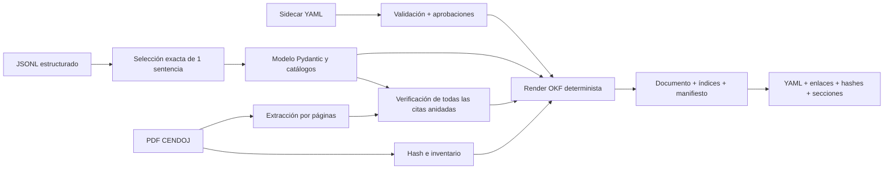

# Pipeline jurisprudencial OKF

Este documento describe el ciclo completo y reproducible que transforma un
registro jurídico del JSONL en un bundle
[Open Knowledge Format (OKF) v0.2](https://github.com/GoogleCloudPlatform/knowledge-catalog/blob/main/okf/SPEC.md).
El piloto está deliberadamente limitado a `SAN_1071_2025.pdf`.

## Estado

| Etapa | Alcance | Estado |
|---|---:|---|
| Piloto | 1 sentencia | Implementado, generado y validado |
| Muestra | 5 sentencias | No ejecutada |
| Corpus | 106 sentencias | No ejecutado |

El documento preparado está en
[`knowledge/jurisprudencia/sentencias/san-1071-2025.md`](../knowledge/jurisprudencia/sentencias/san-1071-2025.md).

## Decisiones

- El PDF es la fuente de máxima autoridad y **nunca se modifica**.
- El texto de la sentencia es inmutable. Puede formatearse, pero no se corrige,
  parafrasea, completa ni reconstruye.
- Solo se publica como cita literal un fragmento recuperado exactamente del
  texto bruto de `pypdf`. La normalización sirve para localizarlo, no para
  generar el texto mostrado.
- Una coincidencia fuzzy nunca produce un extracto de fuente ni un bloque de
  cita. Se muestra como texto del análisis pendiente de revisión.
- El JSONL existente es la fuente del análisis jurídico; el exportador no llama
  a ningún LLM.
- El Markdown es un derivado regenerable y no se edita a mano.
- El texto completo extraído del PDF no se persiste ni se versiona.
- Se versiona únicamente un snapshot JSON del registro seleccionado, suficiente
  para reconstruir el concepto sin llamar de nuevo al LLM.
- Las decisiones editoriales viven en sidecars YAML. Solo una corrección
  `approved`, con revisor y fecha, puede alterar un **metadato derivado**; los
  campos de texto legal están prohibidos.
- Los resúmenes jurídicos se distinguen de las citas literales.
- Una cita solo entra en «Citas literales verificadas» cuando su fidelidad es
  `exact` o `exact_with_ellipsis`.
- Las coincidencias fuzzy o parciales se conservan como candidatas pendientes,
  con estado y puntuación visibles.
- El perfil usa extensiones jurídicas propias. OKF v0.2 exige únicamente
  frontmatter YAML válido y un campo `type` no vacío para cada concepto.

## Entradas y artefactos

### Entradas del piloto

| Entrada | Función |
|---|---|
| `output/analisis_02012026_155032.jsonl` | Análisis jurídico estructurado |
| `sentencias/SAN_1071_2025.pdf` | Fuente original y evidencia textual |
| `knowledge/annotations/san-1071-2025.yaml` | Propuestas y revisiones separadas |
| Umbral `85` | Localización conservadora de citas aproximadas |

El JSONL completo vive en `output/` y no se versiona. El manifiesto conserva su
nombre y SHA-256 para identificar exactamente la ejecución utilizada.

### Bundle generado

```text
knowledge/jurisprudencia/
├── index.md
├── manifest.json
├── sentencias/
    ├── index.md
    └── san-1071-2025.md
└── sources/
    └── san-1071-2025.analysis.json
```

- `index.md` declara `okf_version: "0.2"` y permite descubrir el corpus.
- `sentencias/index.md` enumera los conceptos disponibles.
- El documento de la sentencia contiene frontmatter jurídico, secciones
  legibles, pruebas y citas verificadas.
- `manifest.json` fija hashes, tamaño, páginas, extractor, estado y métricas.
- `sources/*.analysis.json` conserva el registro exacto seleccionado del JSONL.
  Es generado y no se edita a mano.
- `knowledge/annotations/*.yaml` queda fuera del bundle generado para que una
  regeneración no sobrescriba revisiones.

## Flujo



1. Se exige exactamente un registro con el nombre del PDF solicitado.
2. `okf_normalization.py` valida identificadores, resultados, criterios y
   categorías contra los catálogos del proyecto.
3. Cada prueba y cada cita recibe un ID estable basado en contenido, no en su
   posición en una lista.
4. Los valores no canónicos conservan el valor de origen, se degradan al enum
   seguro `CRIT_OTRO` y registran la regla aplicada.
5. Se crea el snapshot del registro y se calculan los SHA-256 del JSONL,
   registro y PDF.
6. El PDF se extrae una sola vez por páginas, conservando índice físico y
   etiqueta impresa.
7. Se verifican las citas de carga de prueba, pruebas de ambas partes, pruebas
   rechazadas, prueba decisiva y `frases_clave`.
8. Un match exacto conserva un mapa de posiciones hacia el texto bruto y extrae
   de él el fragmento publicable. Con elipsis, los fragmentos permanecen
   intactos y se inserta el marcador editorial `[…]`.
9. El sidecar se valida contra IDs existentes. Sus anclajes también deben ser
   subcadenas literales de la página física declarada.
10. Solo se aplican correcciones aprobadas a metadatos permitidos; las
    propuestas se muestran sin alterar el perfil.
11. El renderizador produce siempre el mismo Markdown para las mismas entradas.
12. El bundle se rechaza si falla el frontmatter, una sección, un enlace, un
    recurso o el hash del documento o del snapshot.

## Perfil jurídico

El frontmatter incluye:

- campos OKF: `type`, `title`, `description`, `resource`, `tags`, `sources`,
  `generated` y `status`;
- identificadores: ROJ y ECLI;
- órgano, fecha, ejercicios y países;
- criterios detectados y decisivos;
- resultado y confianza de extracción;
- hashes del PDF y del JSONL;
- resumen cuantitativo de verificación de citas;
- estado de revisión humana y cuestiones propuestas/aprobadas;
- versiones de OKF y del perfil jurídico.

El cuerpo contiene:

- cuestión jurídica;
- hechos y criterios relevantes;
- posiciones de las partes;
- pruebas valoradas;
- carga de la prueba;
- normas y jurisprudencia;
- razonamiento y ratio decidendi;
- fallo;
- resultados separados por cuestión jurídica;
- anotaciones y correcciones, con estado editorial;
- citas literales verificadas;
- citas pendientes;
- trazabilidad con ID, propietario, campo fuente, fidelidad, score y página;
- calidad y procedencia.

Los textos de `resumen_criterios`, `razonamiento_residencia`, pruebas y resultado
proceden del JSONL y se identifican como contenido narrativo derivado. **No son
texto de la sentencia.** Solo los bloques señalados explícitamente como
extractos literales proceden del PDF.

## Sidecars y revisión

El esquema `knowledge/annotations/*.yaml` tiene versión propia y dos tipos de
entrada:

- `corrections`: correcciones de metadatos derivados. Los únicos campos
  permitidos hoy son `criterio_atacado` y `resultado_final`;
- `issues`: resultados por cuestión jurídica, con IDs de citas y/o anclajes
  literales del PDF.

Los estados son `proposed` y `approved`. Una entrada aprobada exige
`reviewed_by` y `reviewed_at`. Solo se marca `human_reviewed: true` cuando todas
las entradas existentes están aprobadas y todos los revisores usan una identidad
`human:*`. Un proceso automático nunca se presenta como revisión humana.

Están prohibidas las correcciones de `analysis_quote`,
`source_excerpt_verbatim`, `texto`, `pdf`, `resumen_criterios` y
`razonamiento_residencia`. Para corregir un error del análisis se conserva el
valor anterior y se añade una anotación; nunca se sobrescribe el texto fuente.

## Resultado del piloto

| Métrica | Resultado |
|---|---:|
| Documentos OKF | 1 |
| PDF | 6 páginas, 143.201 bytes |
| Citas evaluadas | 17 |
| Evidencia localizada | 14 |
| Citas literales publicables | 12 |
| Textos del análisis pendientes | 5 |
| Cuestiones jurídicas propuestas | 3 |
| Cuestiones aprobadas | 0 |
| Ficheros Markdown | 3 |
| Caracteres del concepto | 17.111 |
| Coste LLM | 0 |

El documento permanece en `status: draft` por dos motivos observables:

1. cinco entradas no pueden publicarse como citas literales;
2. una prueba del JSONL usa `CRIT_VIVIENDA_Y_USO_EFECTIVO`, que no pertenece al
   catálogo, conserva ese valor de origen y se normaliza a `CRIT_OTRO`;
3. las tres cuestiones y la reclasificación propuesta no tienen todavía
   aprobación humana.

La fuente registra `gpt-5-mini-2025-08-07`, pero el JSONL histórico no conservó
el hash del prompt. El manifiesto lo declara como `null` y
`not_recorded_in_source_analysis`; no se inventa una procedencia retrospectiva.
Las futuras ejecuciones deberían persistir modelo, hash del prompt y versión del
schema en el momento de generar cada registro.

## Ejecución

```bash
# Ciclo completo del piloto de una sentencia
make export-okf

# Equivalente explícito
uv run python export_okf.py \
  --jsonl output/analisis_02012026_155032.jsonl \
  --pdf-dir sentencias \
  --output-dir knowledge/jurisprudencia \
  --annotations-dir knowledge/annotations \
  --source-file SAN_1071_2025.pdf \
  --threshold 85
```

Variables admitidas por el Makefile:

```text
OKF_JSONL
OKF_SOURCE_FILE
OKF_THRESHOLD
OKF_OUTPUT
```

`OKF_SOURCE_FILE` es obligatorio en el CLI y el target mantiene por defecto la
única sentencia del piloto. No existe una opción implícita de «todas».

## Componentes

| Archivo | Responsabilidad |
|---|---|
| `okf_models.py` | Perfil jurídico normalizado y procedencia |
| `okf_stable_ids.py` | IDs estables basados en contenido |
| `okf_citation_normalization.py` | Descubrimiento de todas las citas anidadas |
| `okf_normalization.py` | Conversión y validación desde JSONL |
| `okf_annotations.py` | Sidecars, restricciones y aplicación de aprobaciones |
| `okf_annotation_rendering.py` | Cuestiones y auditoría editorial |
| `citation_source_validation.py` | Gate literal contra las páginas brutas |
| `okf_rendering.py` | Frontmatter y ensamblado del concepto |
| `okf_render_sections.py` | Tablas de pruebas y secciones de citas |
| `okf_provenance.py` | Snapshot, hashes y versión del extractor |
| `okf_bundle.py` | Orquestación del ciclo de una sentencia |
| `okf_bundle_artifacts.py` | Índices y manifiesto |
| `okf_validation.py` | Conformidad, enlaces, recursos y hashes |
| `export_okf.py` | CLI |
| `test/test_okf_normalization.py` | Contrato del perfil y render |
| `test/test_okf_annotations.py` | Inmutabilidad y contrato de sidecars |
| `test/test_okf_bundle.py` | Ciclo integral, determinismo y bundle versionado |

## Gates antes de pasar a cinco

- `make fast-check` verde.
- Dos ejecuciones consecutivas producen hashes idénticos.
- Revisión humana del Markdown del piloto.
- Revisión de las cinco entradas pendientes, sin convertir matches fuzzy en
  citas.
- Aprobar o rechazar las tres cuestiones y la reclasificación propuesta.
- Confirmación de que el nivel de detalle de las tablas es suficiente.
- Aprobación expresa para ejecutar
  `sentencias/verificacion_citas_muestra_5.json`.

Hasta entonces no se genera el bundle de cinco ni el de 106.
