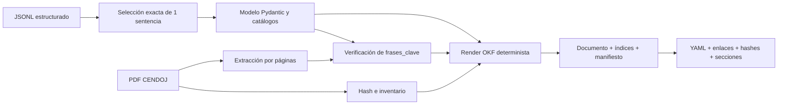

# Pipeline jurisprudencial OKF

Este documento describe el ciclo completo y reproducible que transforma un
registro jurídico del JSONL en un bundle
[Open Knowledge Format (OKF) v0.2](https://github.com/GoogleCloudPlatform/knowledge-catalog/blob/main/okf/SPEC.md).
El piloto está deliberadamente limitado a `SAN_1071_2025.pdf`.

## Estado

| Etapa | Alcance | Estado |
|---|---:|---|
| Piloto | 1 sentencia | Implementado, generado y validado |
| Muestra | 5 sentencias | No ejecutada |
| Corpus | 106 sentencias | No ejecutado |

El documento preparado está en
[`knowledge/jurisprudencia/sentencias/san-1071-2025.md`](../knowledge/jurisprudencia/sentencias/san-1071-2025.md).

## Decisiones

- El PDF es la fuente de máxima autoridad y nunca se modifica.
- El JSONL existente es la fuente del análisis jurídico; el exportador no llama
  a ningún LLM.
- El Markdown es un derivado regenerable y no se edita a mano.
- El texto completo extraído del PDF no se persiste ni se versiona.
- Los resúmenes jurídicos se distinguen de las citas literales.
- Una cita solo entra en «Citas literales verificadas» cuando su fidelidad es
  `exact` o `exact_with_ellipsis`.
- Las coincidencias fuzzy o parciales se conservan como candidatas pendientes,
  con estado y puntuación visibles.
- El perfil usa extensiones jurídicas propias. OKF v0.2 exige únicamente
  frontmatter YAML válido y un campo `type` no vacío para cada concepto.

## Entradas y artefactos

### Entradas del piloto

| Entrada | Función |
|---|---|
| `output/analisis_02012026_155032.jsonl` | Análisis jurídico estructurado |
| `sentencias/SAN_1071_2025.pdf` | Fuente original y evidencia textual |
| Umbral `85` | Localización conservadora de citas aproximadas |

El JSONL completo vive en `output/` y no se versiona. El manifiesto conserva su
nombre y SHA-256 para identificar exactamente la ejecución utilizada.

### Bundle generado

```text
knowledge/jurisprudencia/
├── index.md
├── manifest.json
└── sentencias/
    ├── index.md
    └── san-1071-2025.md
```

- `index.md` declara `okf_version: "0.2"` y permite descubrir el corpus.
- `sentencias/index.md` enumera los conceptos disponibles.
- El documento de la sentencia contiene frontmatter jurídico, secciones
  legibles, pruebas y citas verificadas.
- `manifest.json` fija hashes, tamaño, páginas, extractor, estado y métricas.

## Flujo



1. Se exige exactamente un registro con el nombre del PDF solicitado.
2. `okf_normalization.py` valida identificadores, resultados, criterios y
   categorías contra los catálogos del proyecto.
3. Los valores no canónicos de una prueba se degradan al enum seguro
   `CRIT_OTRO` y quedan registrados como advertencia; no se inventa otro
   criterio jurídico.
4. Se calcula el SHA-256 del JSONL y del PDF.
5. El PDF se extrae una sola vez por páginas, conservando índice físico y
   etiqueta impresa.
6. Cada `frase_clave` se verifica con el pipeline de citas.
7. El renderizador produce siempre el mismo Markdown para las mismas entradas.
8. Los índices y el manifiesto se generan automáticamente.
9. El bundle se rechaza si falla el frontmatter, `type`, una sección exigida,
   un enlace, un recurso o un hash.

## Perfil jurídico

El frontmatter incluye:

- campos OKF: `type`, `title`, `description`, `resource`, `tags`, `sources`,
  `generated` y `status`;
- identificadores: ROJ y ECLI;
- órgano, fecha, ejercicios y países;
- criterios detectados y decisivos;
- resultado y confianza de extracción;
- hashes del PDF y del JSONL;
- resumen cuantitativo de verificación de citas;
- versiones de OKF y del perfil jurídico.

El cuerpo contiene:

- cuestión jurídica;
- hechos y criterios relevantes;
- posiciones de las partes;
- pruebas valoradas;
- carga de la prueba;
- normas y jurisprudencia;
- razonamiento y ratio decidendi;
- fallo;
- citas literales verificadas;
- citas pendientes;
- calidad y procedencia.

Los textos de `resumen_criterios`, `razonamiento_residencia`, pruebas y resultado
proceden del JSONL. No se realiza una nueva síntesis mediante LLM.

## Resultado del piloto

| Métrica | Resultado |
|---|---:|
| Documentos OKF | 1 |
| PDF | 6 páginas, 143.201 bytes |
| Citas evaluadas | 4 |
| Citas literales | 3 |
| Citas pendientes | 1 |
| Ficheros Markdown | 3 |
| Caracteres Markdown | 7.833 |
| Tokens estimados (`o200k_base`) | 2.159 |
| Coste LLM | 0 |

El documento permanece en `status: draft` por dos motivos observables:

1. una cita obtiene 80,56 y queda como `partial`, no literal;
2. una prueba del JSONL usa `CRIT_VIVIENDA_Y_USO_EFECTIVO`, que no pertenece al
   catálogo de criterios y se normaliza a `CRIT_OTRO` dejando advertencia.

## Ejecución

```bash
# Ciclo completo del piloto de una sentencia
make export-okf

# Equivalente explícito
uv run python export_okf.py \
  --jsonl output/analisis_02012026_155032.jsonl \
  --pdf-dir sentencias \
  --output-dir knowledge/jurisprudencia \
  --source-file SAN_1071_2025.pdf \
  --threshold 85
```

Variables admitidas por el Makefile:

```text
OKF_JSONL
OKF_SOURCE_FILE
OKF_THRESHOLD
OKF_OUTPUT
```

`OKF_SOURCE_FILE` es obligatorio en el CLI y el target mantiene por defecto la
única sentencia del piloto. No existe una opción implícita de «todas».

## Componentes

| Archivo | Responsabilidad |
|---|---|
| `okf_models.py` | Perfil jurídico normalizado y procedencia |
| `okf_normalization.py` | Conversión y validación desde JSONL |
| `okf_rendering.py` | Frontmatter y ensamblado del concepto |
| `okf_render_sections.py` | Tablas de pruebas y secciones de citas |
| `okf_bundle.py` | Orquestación del ciclo de una sentencia |
| `okf_bundle_artifacts.py` | Índices y manifiesto |
| `okf_validation.py` | Conformidad, enlaces, recursos y hashes |
| `export_okf.py` | CLI |
| `test/test_okf_normalization.py` | Contrato del perfil y render |
| `test/test_okf_bundle.py` | Ciclo integral, determinismo y bundle versionado |

## Gates antes de pasar a cinco

- `make fast-check` verde.
- Dos ejecuciones consecutivas producen hashes idénticos.
- Revisión humana del Markdown del piloto.
- Decisión sobre la cita parcial: corregir el JSONL mediante sidecar o
  conservarla como no literal.
- Decisión sobre el criterio no canónico de la prueba.
- Confirmación de que el nivel de detalle de las tablas es suficiente.
- Aprobación expresa para ejecutar
  `sentencias/verificacion_citas_muestra_5.json`.

Hasta entonces no se genera el bundle de cinco ni el de 106.
