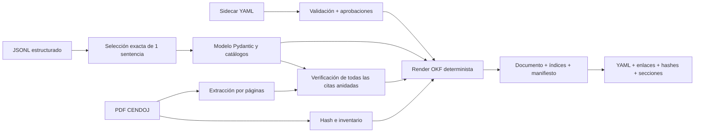

# Pipeline jurisprudencial OKF

Este documento describe el ciclo completo y reproducible que transforma un
registro jurídico del JSONL en un bundle
[Open Knowledge Format (OKF) v0.2](https://github.com/GoogleCloudPlatform/knowledge-catalog/blob/main/okf/SPEC.md).
El rollout está ejecutado para el piloto y una muestra fija de cinco. No existe
ningún modo implícito que amplíe la ejecución a los 106 PDF.

Documentos complementarios:

- [`OKF_MARKDOWN_CONTRACT.md`](OKF_MARKDOWN_CONTRACT.md): contrato completo del
  perfil Markdown v2;
- [`CHAT_JURISPRUDENCE_USE_CASE.md`](CHAT_JURISPRUDENCE_USE_CASE.md): caso de
  uso rector que debe satisfacer la estructura antes de ampliarse a 106;
- [`JURISPRUDENCE_DATA_V3_ROADMAP.md`](JURISPRUDENCE_DATA_V3_ROADMAP.md):
  arquitectura objetivo, responsabilidades, fases y gates del siguiente ciclo;
- [`VERBATIM_CORPUS.md`](VERBATIM_CORPUS.md): contrato decidido para el texto
  íntegro por páginas y su uso en RAG;
- [`CITATION_VERIFICATION.md`](CITATION_VERIFICATION.md): matching, puntuaciones
  y fidelidad literal.

## Estado

| Etapa | Alcance | Estado |
|---|---:|---|
| Piloto | 1 sentencia | Implementado, generado y validado |
| Muestra | 5 sentencias | Implementada, generada y validada |
| Corpus | 106 sentencias | No ejecutado |

Esta tabla describe el pipeline **v2** existente. La transición orientada al
chat todavía está en:

| Etapa v3 | Alcance | Estado |
|---|---:|---|
| Contrato `residenciafiscal-case/3` | Schema y tests | Implementado |
| Contrato `residenciafiscal-verbatim/1` | Schema, extractor y tests | Implementado |
| Verbatim piloto v3 | `SAN 1210/2023` | Generado y validado |
| Caso jurídico piloto v3 | `SAN 1210/2023` | Generado y validado |
| Perfil OKF/3 e índice por cuestión | `SAN 1210/2023` | Generados y validados |
| Muestra v3 | 5 sentencias | Generada y validada |
| Corpus v3 | 106 sentencias | No autorizado |

El piloto v2 se hizo con `SAN 1071/2025`. El piloto v3 usa deliberadamente
`SAN 1210/2023` porque reúne más tipos de cuestiones y pruebas y permite
tensionar el nuevo contrato antes de regenerar la muestra.

El documento preparado está en
[`knowledge/jurisprudencia/sentencias/san-1071-2025.md`](../knowledge/jurisprudencia/sentencias/san-1071-2025.md).
El perfil v3 está en
[`knowledge/jurisprudencia-v3/perfiles/san-1210-2023.md`](../knowledge/jurisprudencia-v3/perfiles/san-1210-2023.md).
La muestra está en
[`knowledge/jurisprudencia-muestra-5/`](../knowledge/jurisprudencia-muestra-5/).
La muestra v3 y su evaluación se describen en
[`JURISPRUDENCE_SAMPLE_PHASE_C.md`](JURISPRUDENCE_SAMPLE_PHASE_C.md).

## Decisiones

- El PDF es la fuente de máxima autoridad y **nunca se modifica**.
- El texto de la sentencia es inmutable. Puede formatearse, pero no se corrige,
  parafrasea, completa ni reconstruye.
- Solo se publica como cita literal un fragmento recuperado exactamente del
  texto bruto de `pypdf`. La normalización sirve para localizarlo, no para
  generar el texto mostrado.
- Una coincidencia fuzzy nunca produce un extracto de fuente ni un bloque de
  cita. Se muestra como texto del análisis pendiente de revisión.
- El JSONL existente es la fuente del perfil v2. El perfil v3 y el índice del
  chat usan exclusivamente `residenciafiscal-case/3`; no leen el JSONL
  histórico.
- El Markdown es un derivado regenerable y no se edita a mano.
- El pipeline v2 no persiste ni versiona el texto completo extraído del PDF.
  El pipeline v3 ya materializa y revalida verbatim, caso, perfil OKF/3 e índice
  por cuestión para `SAN 1210/2023`.
- Se versiona únicamente un snapshot JSON del registro seleccionado, suficiente
  para reconstruir el concepto sin llamar de nuevo al LLM.
- Las decisiones editoriales viven en sidecars YAML. Solo una corrección
  `approved`, con revisor y fecha, puede alterar un **metadato derivado**; los
  campos de texto legal están prohibidos.
- Los resúmenes jurídicos se distinguen de las citas literales.
- Una cita solo entra en «Citas literales verificadas» cuando su fidelidad es
  `exact` o `exact_with_ellipsis`.
- Las coincidencias fuzzy o parciales se conservan como candidatas pendientes.
  La puntuación queda en un informe técnico JSON y no en el Markdown jurídico.
- El flujo es híbrido: el agente propone cuestiones y anclajes literales en
  sidecars; Python conserva la autoridad sobre extracción, hashes, modelos,
  IDs, validación literal, manifiestos y renderizado.
- El perfil usa extensiones jurídicas propias. OKF v0.2 exige únicamente
  frontmatter YAML válido y un campo `type` no vacío para cada concepto.

## Entradas y artefactos

### Entradas del piloto

| Entrada | Función |
|---|---|
| `output/analisis_02012026_155032.jsonl` | Análisis jurídico estructurado |
| `sentencias/SAN_1071_2025.pdf` | Fuente original y evidencia textual |
| `knowledge/annotations/san-1071-2025.yaml` | Propuestas y revisiones separadas |
| Umbral `85` | Localización conservadora de citas aproximadas |

El JSONL completo vive en `output/` y no se versiona. El manifiesto conserva su
nombre y SHA-256 para identificar exactamente la ejecución utilizada.

### Bundle generado

```text
knowledge/jurisprudencia/
├── index.md
├── manifest.json
├── reports/
│   └── san-1071-2025.verification.json
├── sentencias/
│   ├── index.md
│   └── san-1071-2025.md
└── sources/
    └── san-1071-2025.analysis.json
```

- `index.md` declara `okf_version: "0.2"` y permite descubrir el corpus.
- `sentencias/index.md` enumera los conceptos disponibles.
- El documento de la sentencia contiene frontmatter jurídico, secciones
  legibles, pruebas y citas verificadas.
- `manifest.json` fija hashes, tamaño, páginas, extractor, estado y métricas.
- `reports/*.verification.json` conserva IDs completos, campo fuente,
  puntuaciones y páginas; su hash está fijado por el manifiesto.
- `sources/*.analysis.json` conserva el registro exacto seleccionado del JSONL.
  Es generado y no se edita a mano.
- `knowledge/annotations/*.yaml` queda fuera del bundle generado para que una
  regeneración no sobrescriba revisiones.

## Flujo



1. Se exige exactamente un registro con el nombre del PDF solicitado.
2. `okf_normalization.py` valida identificadores, resultados, criterios y
   categorías contra los catálogos del proyecto.
3. Cada prueba y cada cita recibe un ID estable basado en contenido, no en su
   posición en una lista.
4. Los valores no canónicos conservan el valor de origen, se degradan al enum
   seguro `CRIT_OTRO` y registran la regla aplicada.
5. Se crea el snapshot del registro y se calculan los SHA-256 del JSONL,
   registro y PDF.
6. El PDF se extrae una sola vez por páginas, conservando índice físico y
   etiqueta impresa.
7. Se verifican las citas de carga de prueba, pruebas de ambas partes, pruebas
   rechazadas, prueba decisiva y `frases_clave`.
8. Un match exacto conserva un mapa de posiciones hacia el texto bruto y extrae
   de él el fragmento publicable. Con elipsis, los fragmentos permanecen
   intactos y se inserta el marcador editorial `[…]`.
9. El sidecar se valida contra IDs existentes. Sus anclajes también deben ser
   subcadenas literales de la página física declarada.
10. Solo se aplican correcciones aprobadas a metadatos permitidos; las
    propuestas se muestran sin alterar el perfil.
11. El renderizador produce siempre el mismo Markdown para las mismas entradas.
12. El bundle se rechaza si falla el frontmatter, una sección, un enlace, un
    recurso o el hash del documento o del snapshot.

## Perfil jurídico

El frontmatter incluye:

- campos OKF: `type`, `title`, `description`, `resource`, `tags`, `sources`,
  `generated` y `status`;
- identificadores: ROJ y ECLI;
- órgano, fecha, ejercicios y países;
- criterios detectados y decisivos;
- resultado y confianza de extracción;
- hashes del PDF y del snapshot JSON de la sentencia;
- resumen cuantitativo de verificación de citas;
- estado de revisión humana y cuestiones propuestas/aprobadas;
- versiones de OKF y del perfil jurídico.

El cuerpo contiene:

- cuestión jurídica;
- hechos y criterios relevantes;
- posiciones de las partes;
- pruebas valoradas;
- carga de la prueba;
- normas y jurisprudencia;
- razonamiento y ratio decidendi;
- fallo;
- resultados separados por cuestión jurídica;
- anotaciones y correcciones, con estado editorial;
- citas literales verificadas;
- citas pendientes;
- trazabilidad con ID, propietario, campo fuente, fidelidad, score y página;
- calidad y procedencia.

Los textos de `resumen_criterios`, `razonamiento_residencia`, pruebas y resultado
proceden del JSONL y se identifican como contenido narrativo derivado. **No son
texto de la sentencia.** Solo los bloques señalados explícitamente como
extractos literales proceden del PDF.

## Sidecars y revisión

El esquema `knowledge/annotations/*.yaml` tiene versión propia y dos tipos de
entrada:

- `corrections`: correcciones de metadatos derivados. Los únicos campos
  permitidos hoy son `criterio_atacado` y `resultado_final`;
- `issues`: resultados por cuestión jurídica, con IDs de citas y/o anclajes
  literales del PDF.

Los estados son `proposed` y `approved`. Una entrada aprobada exige
`reviewed_by` y `reviewed_at`. Solo se marca `human_reviewed: true` cuando todas
las entradas existentes están aprobadas y todos los revisores usan una identidad
`human:*`. Un proceso automático nunca se presenta como revisión humana.

Están prohibidas las correcciones de `analysis_quote`,
`source_excerpt_verbatim`, `texto`, `pdf`, `resumen_criterios` y
`razonamiento_residencia`. Para corregir un error del análisis se conserva el
valor anterior y se añade una anotación; nunca se sobrescribe el texto fuente.

### Procedimiento de revisión humana

La revisión de una sentencia debe seguir este orden:

1. Regenerar el bundle desde el PDF, el snapshot y el sidecar vigente.
2. Abrir el perfil y el PDF identificado por `source_sha256`.
3. Comprobar cada cuestión jurídica, corrección propuesta y cita pendiente
   contra su página.
4. Registrar la decisión exclusivamente en
   `knowledge/annotations/<slug>.yaml`.
5. Mantener `status: proposed` mientras haya duda o falte una segunda
   comprobación requerida por el equipo.
6. Para aprobar, usar `status: approved`, `reviewed_by: human:<identidad>` y una
   fecha ISO en `reviewed_at`.
7. Regenerar y ejecutar los validadores. El pipeline debe rechazar IDs ausentes,
   valores fuera de catálogo o anclajes no literales.
8. Revisar el diff del sidecar y del perfil generado por separado.

Una aprobación no convierte el análisis derivado en texto de la sentencia.
Significa únicamente que una persona ha revisado esa decisión editorial. Para
rectificar una aprobación, se modifica el sidecar en otro commit conservando el
historial de Git; no se reescribe el PDF ni un extracto literal.

La identidad concreta de las personas autorizadas y si determinadas decisiones
requieren doble revisión son reglas organizativas todavía pendientes. Antes de
publicar el corpus como revisado deberá existir esa lista de responsables.

## Resultado del piloto

| Métrica | Resultado |
|---|---:|
| Documentos OKF | 1 |
| PDF | 6 páginas, 143.201 bytes |
| Citas evaluadas | 17 |
| Evidencia localizada | 14 |
| Citas literales publicables | 12 |
| Textos del análisis pendientes | 5 |
| Cuestiones jurídicas propuestas | 3 |
| Cuestiones aprobadas | 0 |
| Ficheros Markdown | 3 |
| Caracteres del concepto | 17.111 |
| Coste LLM | 0 |

El documento permanece en `status: draft` por tres motivos observables:

1. cinco entradas no pueden publicarse como citas literales;
2. una prueba del JSONL usa `CRIT_VIVIENDA_Y_USO_EFECTIVO`, que no pertenece al
   catálogo, conserva ese valor de origen y se normaliza a `CRIT_OTRO`;
3. las tres cuestiones y la reclasificación propuesta no tienen todavía
   aprobación humana.

La fuente registra `gpt-5-mini-2025-08-07`, pero el JSONL histórico no conservó
el hash del prompt. El manifiesto lo declara como `null` y
`not_recorded_in_source_analysis`; no se inventa una procedencia retrospectiva.
Las futuras ejecuciones deberían persistir modelo, hash del prompt y versión del
schema en el momento de generar cada registro.

### Experimento de autoría por agente

Se ha preparado una versión paralela, no productiva, elaborada desde el PDF para
comparar cobertura jurídica y garantías operativas:

- [perfil experimental](../experiments/okf-agent/san-1071-2025.agent.md);
- [informe agente frente a pipeline](experiments/AGENT_VS_PIPELINE_SAN_1071_2025.md).

El experimento no sobrescribe el perfil canónico ni sus hashes. Su conclusión es
usar agentes para producir o revisar datos estructurados y mantener en Python la
validación, recuperación literal y generación del Markdown.
`agent_profile_validation.py` y su test de regresión comprueban el hash del PDF,
la unicidad de IDs, las páginas y la literalidad de todos los bloques
`SOURCE_EXCERPT`.

## Ejecución

```bash
# Ciclo completo del piloto de una sentencia
make export-okf

# Muestra fija de cinco; el destino debe ser nuevo
make export-okf-sample OKF_SAMPLE_OUTPUT=knowledge/jurisprudencia-muestra-5-nueva

# Equivalente explícito
uv run python export_okf.py \
  --jsonl output/analisis_02012026_155032.jsonl \
  --pdf-dir sentencias \
  --output-dir knowledge/jurisprudencia \
  --annotations-dir knowledge/annotations \
  --source-file SAN_1071_2025.pdf \
  --threshold 85
```

Variables admitidas por el Makefile:

```text
OKF_JSONL
OKF_SOURCE_FILE
OKF_THRESHOLD
OKF_OUTPUT
OKF_SAMPLE_MANIFEST
OKF_SAMPLE_OUTPUT
```

`OKF_SOURCE_FILE` es obligatorio en el CLI y el target mantiene por defecto la
única sentencia del piloto. No existe una opción implícita de «todas».
`export-okf-sample` exige el manifiesto específico y rechaza un destino
existente para no sobrescribir una revisión anterior.

## Rollout operativo

### Piloto: una sentencia

`export_okf.py` acepta exactamente un `source_file`. Esta limitación es
intencionada: evita ampliar el corpus por accidente y permite validar el
contrato con una entrada conocida.

### Estado actual: muestra fija de cinco

`export_okf_batch.py` y `okf_batch.py` ejecutan las cinco entradas congeladas en
`sentencias/okf_muestra_5.json`. El constructor unitario y el batch reutilizan
`build_okf_document()`; no existe un segundo camino de normalización.

El lote cumple este contrato:

- recibir una lista o manifiesto explícito; nunca descubrir «todos los PDF» por
  defecto;
- ordenar de forma determinista por `source_file`;
- verificar antes el hash del JSONL, de cada PDF y de cada registro canónico;
- construir cada sentencia con la misma función común;
- no crear ni sobrescribir sidecars;
- escribir primero en un directorio temporal y publicar solo artefactos
  validados;
- abortar el lote completo ante cualquier fallo, sin publicar un corpus parcial;
- rechazar duplicados y destinos existentes;
- generar índices, snapshots, informes de verificación y manifiesto agregado
  solo después de construir los cinco conceptos;
- validar enlaces, secciones, cardinalidad y hashes antes del renombrado
  atómico.

El manifiesto de citas
`sentencias/verificacion_citas_muestra_5.json` no se reutiliza: responde a otro
contrato. `sentencias/okf_muestra_5.json` fija las fuentes exactas y la versión
esperada del manifiesto de salida.

Resultado medido de la primera ejecución:

| Métrica | Valor |
|---|---:|
| Documentos | 5 |
| Candidatos de cita | 98 |
| Citas literales publicables | 81 |
| Pendientes | 17 |
| Cuestiones jurídicas propuestas | 12 |
| Cuestiones aprobadas por una persona | 0 |

El detalle de la revisión híbrida está en
[`experiments/OKF_SAMPLE_5_REVIEW.md`](experiments/OKF_SAMPLE_5_REVIEW.md).

### Fase de corpus: 106 sentencias

La ejecución completa reutilizará la misma orquestación; no tendrá un segundo
camino de normalización. Antes de autorizarla:

1. Se revisan las cinco salidas y sus PDF.
2. Se migra el perfil v2: el
   [`piloto de 40 preguntas`](experiments/CHAT_QUESTION_PILOT_5.md) confirma que
   hacen falta cuestiones, hechos, relaciones prueba→hecho→cuestión,
   cronología, resultados por cuestión y anclajes por proposición.
3. Se congela el manifiesto de entrada con nombre y SHA-256 de cada PDF.
4. Se fijan los gates con los datos observados en la muestra.
5. Se documenta qué artefactos `draft` pueden generarse y cuáles pueden
   publicarse.
6. Se implementa el corpus `verbatim/` canónico en JSON por páginas y se mide
   su tamaño antes de decidir su almacenamiento para las 106.

Generar un perfil `draft` y publicarlo como jurídicamente revisado son acciones
distintas. La ejecución batch puede producir borradores; la interfaz de consumo
debe exponer claramente `status` y `human_reviewed`.

## Componentes

| Archivo | Responsabilidad |
|---|---|
| `okf_models.py` | Perfil jurídico normalizado y procedencia |
| `okf_stable_ids.py` | IDs estables basados en contenido |
| `okf_citation_normalization.py` | Descubrimiento de todas las citas anidadas |
| `okf_normalization.py` | Conversión y validación desde JSONL |
| `okf_annotations.py` | Sidecars, restricciones y aplicación de aprobaciones |
| `okf_annotation_rendering.py` | Cuestiones y auditoría editorial |
| `citation_source_validation.py` | Gate literal contra las páginas brutas |
| `okf_rendering.py` | Frontmatter y ensamblado del concepto |
| `okf_render_sections.py` | Tablas de pruebas y secciones de citas |
| `okf_provenance.py` | Snapshot, hashes y versión del extractor |
| `okf_document_builder.py` | Ciclo común por sentencia |
| `okf_bundle.py` | Orquestación del bundle unitario |
| `okf_batch.py` | Publicación atómica del lote |
| `okf_batch_manifest.py` | Selección congelada y validación de fuentes |
| `okf_bundle_artifacts.py` | Índices y manifiesto |
| `okf_verification_report.py` | Trazabilidad técnica fuera del Markdown |
| `okf_validation.py` | Conformidad, enlaces y secciones |
| `okf_manifest_validation.py` | Cardinalidad y hashes del manifiesto |
| `export_okf.py` | CLI unitario |
| `export_okf_batch.py` | CLI de muestra explícita |
| `test/test_okf_normalization.py` | Contrato del perfil y render |
| `test/test_okf_annotations.py` | Inmutabilidad y contrato de sidecars |
| `test/test_okf_bundle.py` | Ciclo integral, determinismo y bundle versionado |

## Gates aplicados al pasar a cinco

- Cien por cien de los PDF conservan su SHA-256 durante la exportación.
- Cien por cien de los fragmentos publicados como literales son subcadenas
  exactas de su página bruta.
- Cero IDs, enlaces, hashes o referencias de sidecar inválidos.
- `make fast-check` verde.
- Dos ejecuciones consecutivas producen hashes idénticos.
- Revisión asistida de los cinco perfiles, sin convertir matches fuzzy en citas.
- Las propuestas del agente permanecen `proposed` hasta revisión humana.

Estos gates técnicos están cumplidos para la muestra. La revisión jurídica
humana y la clasificación de las 17 citas pendientes siguen abiertas; por eso
cuatro perfiles tienen estado `draft` y el rollout a 106 no está autorizado.

## Gates de cinco al corpus completo

Los invariantes anteriores siguen siendo bloqueantes. Además, la muestra debe
producir y conservar:

- resultado explícito para los cinco documentos, sin omisiones silenciosas;
- revisión humana de los cinco perfiles frente a sus PDF;
- clasificación manual de todas las citas fuzzy, parciales y no localizadas;
- conteo de falsos literales: debe ser cero;
- inventario de páginas vacías, defectos de orden de lectura y errores de
  extracción;
- distribución de `evidence_status`, fidelidad y puntuaciones;
- tasa de valores no canónicos y reglas de normalización aplicadas;
- tamaño y coste de almacenamiento de perfiles, snapshots y, si se prueba,
  representación verbatim JSON;
- decisión documentada sobre el umbral basada en esos datos;
- aprobación de cualquier cambio de schema antes de regenerar el corpus.

No se fija ahora un porcentaje mínimo de literalidad: una sentencia puede tener
menos citas literales porque el análisis de origen sea peor, no porque el
verificador falle. El gate jurídico es no presentar nunca texto aproximado como
literal. Las tasas sirven para decidir revisión, calidad del análisis y
prioridad, no para maquillar el corpus bajando el umbral.

La evaluación de recuperación del futuro chat tendrá su banco de preguntas y
sus métricas de recall por separado. El inventario y la primera verdad de
referencia manual ya existen en
[`CHAT_USER_QUESTION_CATALOG.md`](CHAT_USER_QUESTION_CATALOG.md) y
[`experiments/CHAT_QUESTION_PILOT_5.md`](experiments/CHAT_QUESTION_PILOT_5.md).
No bloquea la generación de borradores, pero el contrato de datos que revela sí
debe fijarse antes de regenerar las cinco y ampliar a 106.
