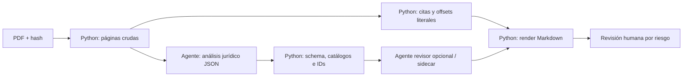

# Comparación: perfil generado frente a perfil elaborado por agente

## Alcance

Se comparan:

- perfil productivo:
  [`knowledge/jurisprudencia/sentencias/san-1071-2025.md`](../../knowledge/jurisprudencia/sentencias/san-1071-2025.md);
- perfil experimental del agente:
  [`experiments/okf-agent/san-1071-2025.agent.md`](../../experiments/okf-agent/san-1071-2025.agent.md);
- fuente común: `sentencias/SAN_1071_2025.pdf`, SHA-256
  `43be81687f4871186c1c34a3c2a97166fc64753662d4d4914bf03c466873c3cf`.

La comparación es orientativa, no ciega: el agente conocía el esquema y había
visto el perfil productivo antes de elaborar la versión experimental. Ninguna de
las dos interpretaciones ha recibido revisión jurídica humana.

## Qué se está comparando realmente

El perfil actual no es «Python entendiendo una sentencia». Su flujo es:

```text
PDF → análisis LLM estructurado → JSONL → Python normaliza/verifica/renderiza
```

El experimento es:

```text
PDF → agente lee, interpreta, selecciona citas y escribe Markdown
```

Por tanto, la decisión útil no es LLM o Python. La decisión es dónde permitir
juicio semántico y dónde exigir ejecución determinista.

## Métricas descriptivas

| Métrica | Perfil productivo | Perfil agente |
|---|---:|---:|
| Caracteres | 17.111 | 15.194 |
| Palabras | 1.939 | 2.233 |
| Líneas | 262 | 234 |
| Cuestiones desglosadas | 3 | 5, incluida costas |
| Citas inventariadas | 17 | 7 seleccionadas |
| Extractos literales validados | 12 | 7 |
| Candidatas pendientes | 5 | 0 presentadas como citas |
| IDs estables y trazabilidad automática | Sí | No |
| Reproducible desde entradas y versión | Sí | No por sí solo |

La tasa literal no es comparable: el pipeline verifica todas las citas del JSON
de origen, mientras que el agente seleccionó únicamente siete pasajes que podía
copiar exactamente. Es una selección sesgada hacia casos fáciles.

Los siete `SOURCE_EXCERPT` del experimento se comprobaron mecánicamente como
subcadenas exactas de las páginas 3, 4, 5 y 6. La comprobación queda protegida
por `agent_profile_validation.py` y `test/test_agent_profile_validation.py`.

## Diferencias jurídicas observadas

### Cobertura de cuestiones

El perfil productivo describe correctamente el resultado global `PARCIAL` y
separa residencia, ganancia patrimonial y sanción mediante sidecar. El agente
detecta además:

- la reducción de la base imponible por pensión compensatoria;
- la ausencia de imposición especial de costas.

La pensión compensatoria es una cuestión sustantiva con razonamiento propio en
la página 5. Conviene incorporarla al futuro schema de cuestiones, no dejarla
solo como una prueba de contexto.

### Uso del certificado francés

El perfil productivo afirma que el certificado francés no desvirtúa la
residencia y le asigna peso 2. En el PDF, el uso explícito del certificado
aparece en el fundamento sancionador: contribuye a considerar razonable la
interpretación del recurrente y a excluir la culpabilidad.

Puede ser razonable analizar su posible valor para residencia, pero debe
etiquetarse como inferencia del analista, no como valoración expresa de la Sala.

### Vivienda de La Boulou

El perfil productivo la presenta como prueba de residencia rechazada y afirma
que está contradicha por los suministros de Bescanó. En el texto visible de la
sentencia, la vivienda de La Boulou aparece en el fundamento sobre la relación
entre comprador y vendedor de las participaciones.

La versión del agente conserva ese contexto y evita atribuir a la Sala una
valoración autónoma no expresada de manera clara.

### Situación familiar

El perfil productivo incluye como objetivo «desvirtuar presunción por residencia
del cónyuge en España». El PDF dice que el recurrente se divorció de su esposa
de nacionalidad francesa y que sus hijos residían en Suiza. No aparece un
cónyuge residente en España.

Este es un candidato claro a corrección del análisis estructurado.

### Carga de la prueba

El perfil productivo reduce la carga a `AEAT`, cumplida. El agente refleja dos
movimientos descritos por la Sala:

- la Administración acreditó la residencia española;
- el recurrente no acreditó actividad, rentas, bienes o lazos en Francia.

Un modelo por cuestión y por hecho sería más fiel que un único campo global.

### Pesos numéricos

El perfil productivo asigna pesos de 1 a 5 a cada prueba. La sentencia no utiliza
esa escala. Puede ser una valoración analítica útil para ordenar evidencia, pero
el nombre y la interfaz deben dejar claro que es `analysis_weight`, no peso
atribuido por el tribunal.

El agente evitó cuantificar y describió el papel de cada elemento como decisivo,
corroborador, rechazado o contextual.

### Normas y ratio

El perfil productivo enumera solo el CDI España-Francia y el Reglamento
1408/71, y su ratio se concentra en residencia. El agente recoge además los
artículos 9, 33, 37.1.b y 55 LIRPF; 179.2.d y 191 LGT; los instrumentos sobre
trabajadores fronterizos y el artículo 139.1 LJCA. También separa la ratio de
ganancia, pensión y sanción.

Aquí el agente ofrece más cobertura, a cambio de un mayor riesgo de omisión o
clasificación variable entre documentos.

## Pros y contras

### Python determinista

Ventajas:

- mismo resultado para las mismas entradas;
- barato y rápido para 106 documentos;
- IDs, hashes, índices y manifiestos consistentes;
- puede probarse con contratos y rechazar texto no literal;
- no degrada el formato entre sentencias;
- permite reanudar y regenerar sin una llamada LLM.

Desventajas:

- no comprende por sí solo nuevas cuestiones jurídicas;
- depende de la calidad del JSON que recibe;
- puede dar apariencia de precisión a una inferencia defectuosa;
- un schema rígido puede forzar categorías o pesos que el tribunal no expresó.

### Agente escribiendo directamente el Markdown

Ventajas:

- puede releer toda la sentencia y detectar cuestiones omitidas;
- relaciona una misma prueba con residencia, liquidación o sanción;
- adapta el análisis a estructuras procesales no previstas;
- puede explicar incertidumbres y evitar rellenar campos artificiales;
- mejora la cobertura de normas, ratio y fallo por cuestiones.

Desventajas:

- el resultado no es determinista;
- puede alterar accidentalmente una cita o inventar una relación;
- tiende a variar títulos, orden, granularidad e IDs;
- es más difícil reanudar, comparar y migrar;
- consume más tokens y tiempo por sentencia;
- una autocorrección del propio agente no equivale a revisión independiente;
- escribir el `.md` final mezcla razonamiento, datos y presentación.

## Recomendación

No se recomienda que un agente escriba directamente los 106 Markdown
productivos. Tampoco se recomienda intentar sustituir el análisis jurídico por
reglas Python.

La mejor arquitectura es híbrida:



Responsabilidades recomendadas:

1. Python extrae páginas, calcula hashes y conserva texto bruto.
2. Un agente produce JSON estricto, no Markdown.
3. El JSON modela cuestiones, decisiones, pruebas y relación entre ellas.
4. El agente propone texto de cita y página; Python localiza y recupera el
   fragmento exacto que se puede publicar.
5. Python valida enums, IDs, referencias y schema.
6. Un segundo pase de agente puede detectar omisiones o contradicciones, pero
   escribe propuestas en sidecar.
7. Python renderiza siempre el `.md` final.
8. La revisión humana se concentra en resultados materiales, inferencias y
   casos de baja confianza.

## Cambios sugeridos al schema antes de cinco sentencias

- Hacer `issues` parte del análisis principal, no solo del sidecar.
- Permitir varias cuestiones por sentencia con resultado y ratio propios.
- Relacionar cada prueba con una o varias `issue_ids`.
- Separar `court_use` de `analyst_inference`.
- Renombrar `peso` a `analysis_weight` o permitir `NO_CUANTIFICADO`.
- Modelar carga de prueba por cuestión o hecho.
- Extraer exhaustivamente normas con página y contexto.
- Registrar en origen modelo, prompt hash y versión de schema.
- Añadir un campo de incertidumbre y motivo, no solo confianza global.

## Decisión para el rollout

Para la muestra de cinco:

- usar un agente por sentencia para producir un JSON v3 candidato;
- conservar el pipeline Python para validación y render;
- comparar el JSON actual con el nuevo, sin sobrescribirlo;
- revisar manualmente las diferencias materiales;
- medir coste, latencia, estabilidad y tasa de correcciones;
- decidir después si merece la pena regenerar las 106.

El experimento con SAN 1071/2025 favorece el enfoque híbrido: el agente mejora
la cobertura jurídica, mientras Python aporta las garantías necesarias para que
esa mejora no comprometa literalidad, reproducibilidad ni estructura.
