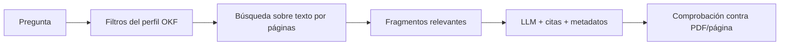

# Representación íntegra por páginas para recuperación

**Estado (2026-07-29):** contrato, extractor, schema y piloto de
`SAN 1210/2023` implementados y validados. La siguiente unidad es construir el
caso jurídico v3 desde esta fuente.

## Decisión para el schema v3

Se generará una segunda representación por sentencia cuya fuente canónica será:

```text
knowledge/jurisprudencia-v3/verbatim/<slug>.pages.json
```

Opcionalmente se renderizará una vista legible:

```text
knowledge/jurisprudencia-v3/verbatim/<slug>.md
```

Su finalidad es búsqueda, RAG y comprobación de respuestas. No sustituye al PDF
ni al perfil jurídico de `sentencias/<slug>.md`.

Se materializará primero para `SAN 1210/2023`, se validará con la muestra de
cinco y solo entonces se autorizará para las 106. El contexto, orden y gates
están en
[`JURISPRUDENCE_DATA_V3_ROADMAP.md`](JURISPRUDENCE_DATA_V3_ROADMAP.md).

La fuente ejecutable del contrato es:

- `verbatim_models.py`: modelos e invariantes;
- `verbatim_hashing.py`: hashes UTF-8 y serialización canónica;
- `verbatim_extraction.py`: adaptador crudo de `pypdf`;
- `verbatim_schema.py`: exportación determinista;
- `schemas/residenciafiscal-verbatim-v1.schema.json`: JSON Schema versionado.

Para regenerar el schema:

```bash
PYTHONPATH=src uv run python -c 'from pathlib import Path; from verbatim_schema import write_verbatim_json_schema; write_verbatim_json_schema(Path("schemas/residenciafiscal-verbatim-v1.schema.json"))'
```

Para regenerar y revalidar el piloto:

```bash
make export-verbatim
```

El target construye en un directorio de staging, valida el JSON contra el PDF
mediante una segunda extracción y solo entonces reemplaza el destino.

## Resultado del piloto

| Dato | Valor |
|---|---|
| Artefacto | `knowledge/jurisprudencia-v3/verbatim/san-1210-2023.pages.json` |
| Extractor | `pypdf/6.14.2` |
| Páginas | 10, todas `TEXT_EXTRACTED` |
| Estado | `COMPLETE` |
| Tamaño | 46.569 bytes |
| SHA-256 del PDF | `4d2f5f31cf8824a4fd9df1214c791e8009d16a250990533b64047467d8459d5d` |
| SHA-256 de páginas | `76a3bd4547c840d2e0f23eb2e6986c7c4c14f4eca528fe98ebd7e93d9ba658ae` |
| SHA-256 del artefacto | `de079bd93436d3c6c4d71604e9efe1573ecd041f14fb3fe52b9e34df38d0d5c1` |

Dos builds consecutivos produjeron los mismos tres hashes y los mismos bytes.
El test del piloto reextrae el PDF y exige que el resultado serializado coincida
exactamente con el artefacto versionado.

## Por qué conviene

El perfil OKF contiene los campos jurídicos que el análisis ya seleccionó. Es
compacto y útil para filtros, comparación y respuestas previsibles, pero puede
omitir un fundamento que una pregunta futura necesite.

El texto por páginas permitiría:

- recuperar pasajes que no fueron seleccionados por el análisis inicial;
- responder preguntas nuevas sin repetir el análisis LLM del PDF;
- comprobar una respuesta contra una página concreta;
- combinar filtros estructurados del perfil con recuperación textual;
- evitar inyectar todas las sentencias en cada llamada.

En un RAG, el flujo recomendado sería:



Solo se enviarían al modelo los fragmentos recuperados y los metadatos
necesarios. El corpus íntegro no se incluiría en cada prompt.

## Qué significa «íntegro»

«Íntegro» significa que, dentro de cada bloque de página, se conserva carácter
por carácter la cadena devuelta por el extractor adoptado. No significa que
`pypdf` reproduzca visualmente el PDF: el orden de lectura, ligaduras o tablas
pueden depender de cómo esté construido el documento.

Por tanto:

- el PDF sigue siendo la fuente oficial;
- el Markdown se describe como «texto extraído», no como transcripción oficial;
- no se eliminan cabeceras, pies, repeticiones, firmas ni avisos;
- no se corrigen palabras, espacios, ligaduras, guiones ni saltos de línea;
- no se resumen fundamentos ni se seleccionan solo partes «relevantes»;
- los marcadores de página son editoriales y se distinguen del texto extraído.

La limpieza jurídica y la selección de relevancia pertenecen al perfil OKF, no
a la representación íntegra.

## Separación de extractores

El extractor histórico de `pdf_page_extraction.py` ejecuta:

```python
(page.extract_text() or "").replace("\\x00", " ").strip()
```

Sigue siendo adecuado para el verificador actual porque conserva los pasajes
interiores, pero no es una fuente verbatim.

`verbatim_extraction.py` ya implementa la separación:

1. llama una sola vez a `page.extract_text()`;
2. conserva la cadena devuelta sin `strip`, sustituciones ni normalización;
3. distingue `None` de `""` mediante `extraction_status`;
4. calcula el hash sobre los bytes UTF-8 exactos;
5. permite que la detección de etiqueta impresa lea una vista sin alterar
   `raw_page_text`.

El Markdown verbatim debe renderizar `raw_page_text`. Si por una limitación
técnica fuera imprescindible transformar un carácter de control, la regla, el
conteo y el hash anterior y posterior deben quedar explícitos en el manifiesto.

## Contrato v1

### JSON canónico

| Campo raíz | Semántica |
|---|---|
| `schema_version` | Siempre `residenciafiscal-verbatim/1` |
| `document_id` | ID estable compartido con el caso jurídico |
| `source_file` | Ruta PDF relativa y portable |
| `source_sha256` | SHA-256 binario del PDF |
| `extractor` | Nombre y versión exacta |
| `page_count` | Número de páginas físicas |
| `pages_sha256` | Hash del array canónico y ordenado de páginas |
| `status` | `COMPLETE` o `NEEDS_REVIEW` |
| `pages` | Registros físicos 1-based, contiguos y ordenados |

Cada página contiene `page_index`, `printed_page`, `raw_page_text`,
`text_sha256` y `extraction_status`. Los estados de página son:

- `TEXT_EXTRACTED`;
- `EMPTY_TEXT`, cuando `pypdf` devuelve `""`;
- `NO_TEXT_RETURNED`, cuando devuelve `None` y el JSON conserva `""` sin
  inventar contenido.

Una página que no sea `TEXT_EXTRACTED` obliga al corpus a
`status: NEEDS_REVIEW`. Si `pypdf` lanza una excepción, la extracción falla
cerrada: no se produce un corpus parcial silencioso.

### Frontmatter

| Campo | Semántica |
|---|---|
| `type` | `Texto extraído de sentencia` |
| `title` | Identificador legible de la resolución |
| `resource` | Ruta al PDF original |
| `source_sha256` | SHA-256 binario del PDF |
| `schema_version` | `residenciafiscal-verbatim/1` |
| `extractor` | Nombre y versión exacta, por ejemplo `pypdf/6.14.2` |
| `page_count` | Número de páginas físicas |
| `pages_sha256` | Hash de la lista canónica y ordenada de registros de página |
| `status` | Derivado del estado del JSON canónico |

`pages_sha256` se calcula sobre el JSON canónico de los registros de página, no
sobre el `.md` que contiene el propio frontmatter. El manifiesto debe conservar
además un hash por página calculado sobre los bytes UTF-8 de `raw_page_text`.

### Cuerpo

Formato propuesto:

```md
# Texto extraído

<!-- BEGIN EXTRACTED PAGE: pdf_page_index=1; printed_page_label=i -->
## Página PDF 1

<cadena exacta devuelta por el extractor>
<!-- END EXTRACTED PAGE -->

<!-- BEGIN EXTRACTED PAGE: pdf_page_index=2; printed_page_label=1 -->
## Página PDF 2

<cadena exacta devuelta por el extractor>
<!-- END EXTRACTED PAGE -->
```

Los comentarios y encabezados son metadatos editoriales. El contenido comprendido
entre el encabezado de página y el marcador final debe poder recuperarse sin
confundir esos marcadores con texto judicial.

El pipeline mantendrá como fuente canónica un JSON por páginas y derivará de él
el Markdown:

```json
{
  "page_index": 2,
  "printed_page": "1",
  "raw_page_text": "...",
  "text_sha256": "...",
  "extraction_status": "TEXT_EXTRACTED"
}
```

Esto evita que un parser de Markdown tenga que deducir dónde termina el formato
editorial y empieza el contenido. El JSON por páginas es el artefacto canónico
para RAG y el `.md` una vista legible opcional.

## Almacenamiento y Git

Recomendación inicial:

- versionar el contrato y los manifiestos;
- generar el texto íntegro de una y cinco sentencias para validación;
- no decidir todavía si los 106 `.md` entran en Git;
- medir tamaño, tokens y estabilidad antes de esa decisión;
- si el despliegue puede regenerarlos desde los PDF, tratarlos como artefactos
  de build o caché;
- si un consumidor no tiene acceso a los PDF, publicarlos como artefacto
  versionado o almacenamiento de objetos, siempre ligados al hash del PDF.

Duplicar en Git todo el texto que ya contienen los PDF no mejora por sí mismo la
trazabilidad. La ventaja aparece cuando el formato se usa realmente como fuente
de indexación o distribución.

## Chunking para RAG

El fichero íntegro no debe cortarse ni reescribirse para almacenarlo. Los chunks
son una representación derivada adicional.

Cada chunk debería conservar:

- `document_id` y `slug`;
- ROJ y ECLI;
- SHA-256 del PDF;
- índice físico de página;
- etiqueta impresa si existe;
- offsets de inicio y fin sobre `raw_page_text`;
- texto exacto del intervalo;
- versión de extractor y estrategia de chunking.

Los chunks pueden usar solapamiento, pero nunca fusionar silenciosamente texto de
páginas distintas. Si un fragmento cruza una página, debe conservar ambos
anclajes.

## Gates de aceptación

### Una sentencia

- El contrato y el JSON Schema están sincronizados.
- Los tests demuestran que no se eliminan `\x00`, espacios ni saltos.
- El PDF conserva su SHA-256 antes y después.
- Existe una entrada por cada página física.
- Cada `raw_page_text` coincide exactamente con la salida cruda del extractor.
- Dos ejecuciones producen hashes idénticos con la misma versión de `pypdf`.
- Los marcadores editoriales no entran en los chunks.
- Una página vacía se registra como vacía; no se inventa contenido ni se omite.

### Cinco sentencias

- Se inspeccionan documentos con diferentes órganos, longitudes y maquetaciones.
- Se revisan orden de lectura, ligaduras, tablas, cabeceras y pies.
- Se mide tamaño total, tokens y número de chunks.
- Se prueba recuperación con preguntas cuyo fundamento no esté en el perfil OKF.
- Se documentan defectos de extracción sin corregir el texto fuente.

### Corpus completo

- Cien por cien de los PDF quedan ligados a un hash y versión de extractor.
- Cien por cien de las páginas tienen registro, incluso si está vacío.
- Cero transformaciones no declaradas.
- Los fallos por documento no invalidan ni sobrescriben artefactos válidos.
- El índice puede reconstruirse desde fuentes y manifiestos sin llamar a un LLM.

## Conclusión

Sí se recomienda esta representación para el futuro RAG. Debe implementarse como
una capa separada:

| Artefacto | Función |
|---|---|
| PDF | Fuente oficial |
| `verbatim/<slug>.pages.json` | Texto íntegro extraído y canónico para búsqueda |
| `verbatim/<slug>.md` | Vista humana opcional del JSON por páginas |
| `sentencias/<slug>.md` | Perfil jurídico estructurado |
| Sidecar YAML | Revisión y decisiones editoriales |
| Chunks/índice | Derivado de recuperación |

No se recomienda usarla para inyectar las 106 sentencias completas en cada
llamada. Su valor está en permitir recuperación selectiva, trazable y económica.
